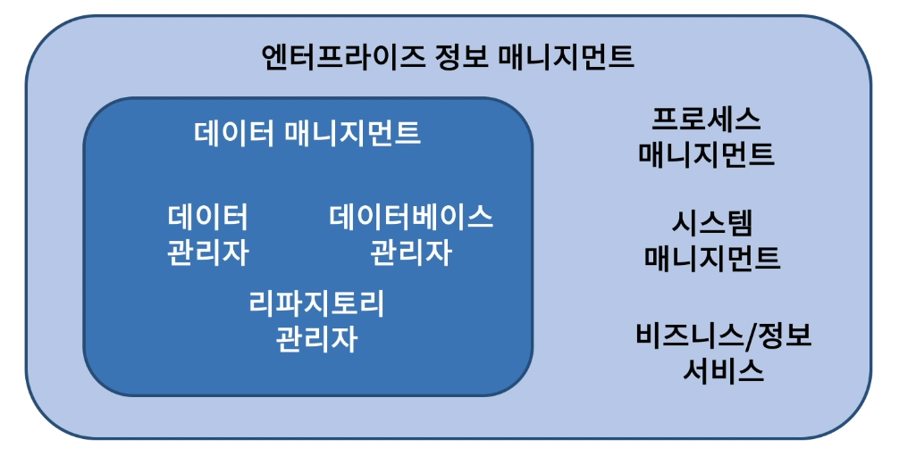
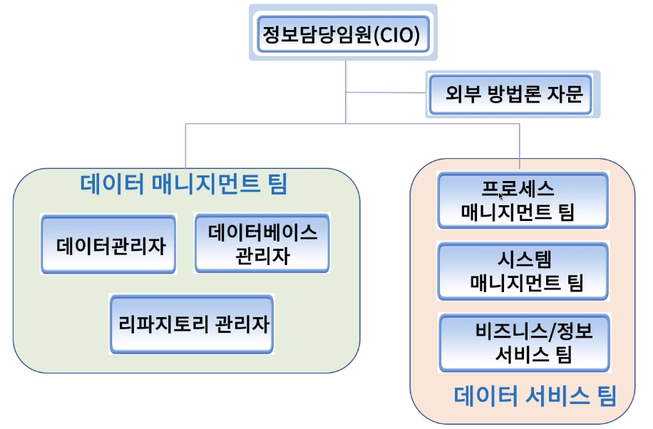
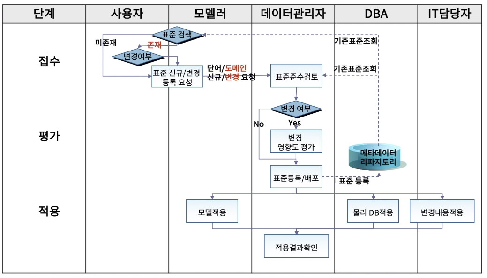
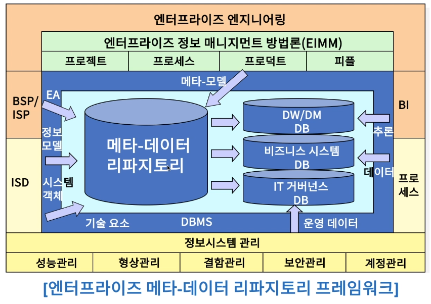

[toc]

# 엔터프라이즈 통합 데이터 모델 관리하기

## :heavy_check_mark: 엔터프라이즈 데이터 및 정보 매니지먼트 관계

## :heavy_check_mark: 엔터프라이즈 데이터 매니지먼트 조직 구조

## :heavy_check_mark: 엔터프라이즈 통합 데이터 모델 변경 태스트 예

## :heavy_check_mark: 엔터프라이즈 통합 데이터 매니지먼트를 위한 메타-데이터 리파지토리

