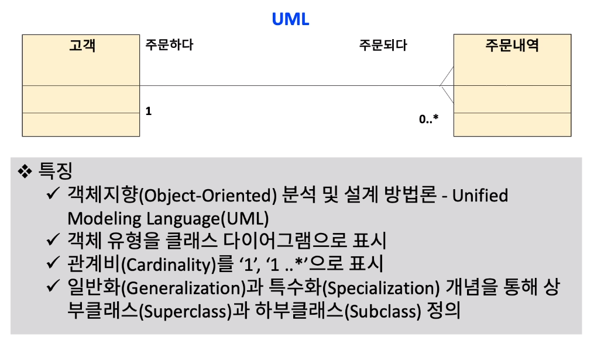

[toc]

# 데이터 모델 표기법 (Notation)

## :heavy_check_mark: 엔티티 관계(ER) 모델링 표기법 - Chen 표기법

## :heavy_check_mark: 엔티티 관계(ER) 모델링 - 정보공학(Information Engineering) 기법

## :heavy_check_mark: 엔티티 관계(ER) 모델링 - Ellis-Barker 표기법

## :heavy_check_mark: 엔티티 관계(ER) 모델링 - IDEF1X 표기법

## :heavy_check_mark: 엔티티 관계(ER) 모델링 - UML 표기법

