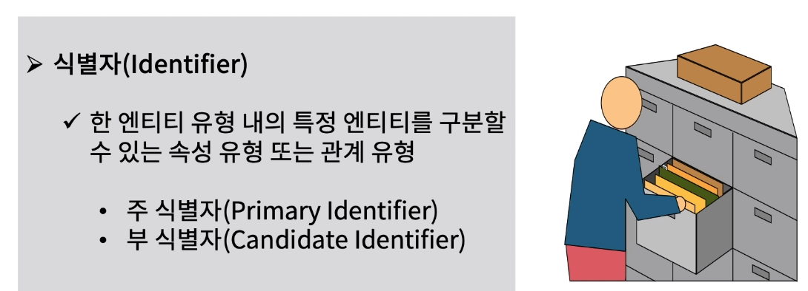
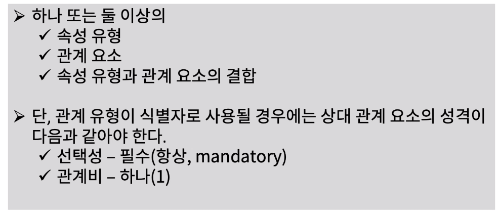
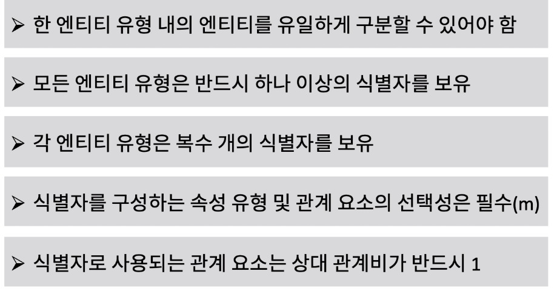
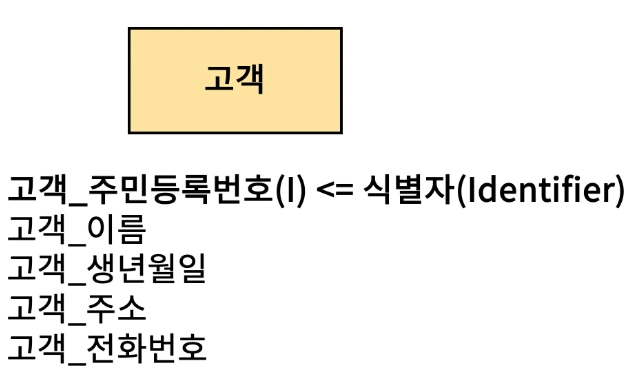
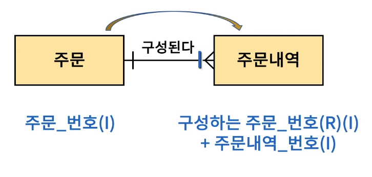
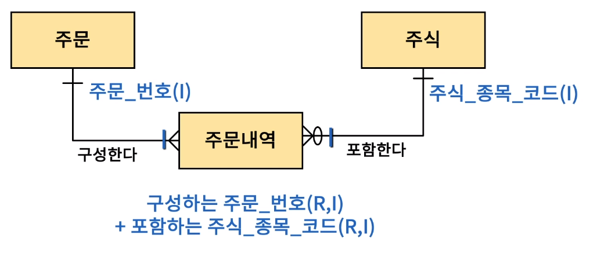

[toc]

# 식별자(Indentifier) 정의하기

## :heavy_check_mark: 식별자 란?

### 식별자 구성 기준

## :heavy_check_mark: 식별자에 대한 비즈니스 규칙

## :heavy_check_mark: 단일 및 복합 속성 유형 식별자

## :heavy_check_mark: 속성 유형과 관계 요소 결합 식별자

## :heavy_check_mark: 관계 요소와 관계 요소 결합 식별자

