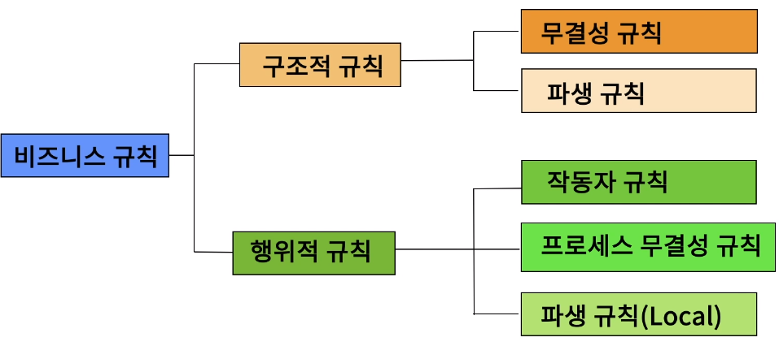
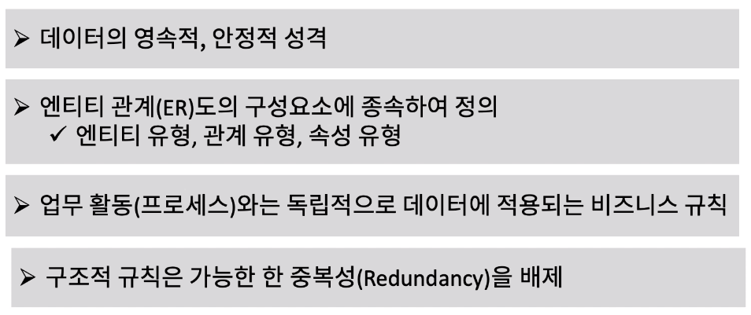
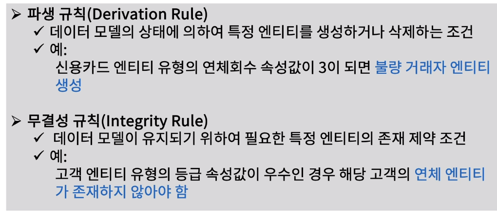
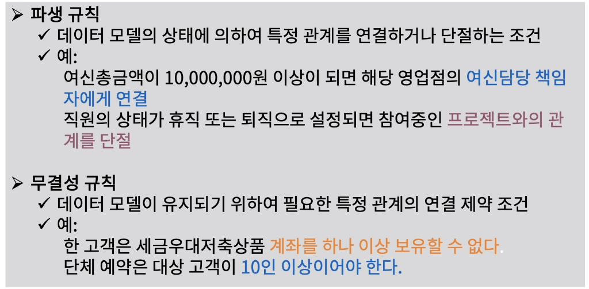
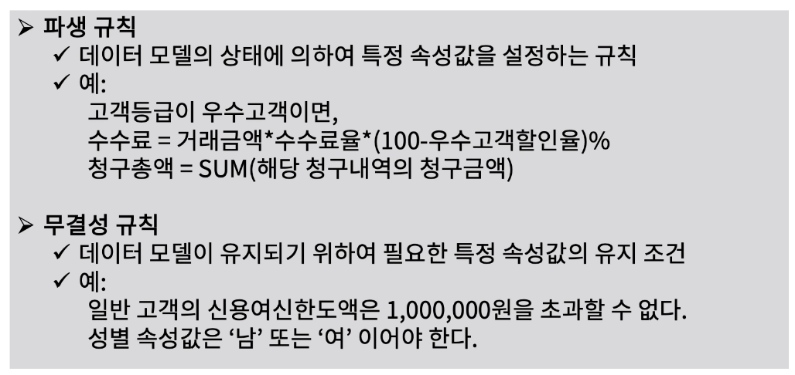

[toc]

# 구조적 규칙 정의

## :heavy_check_mark: 비즈니스 규칙(Business Rule) 이란?

## :heavy_check_mark: 구조적 규칙 (Structural Rule) 이란?

## :heavy_check_mark: 엔티티 유형 파생, 무결성 규칙

## :heavy_check_mark: 관계 유형 파생, 무결성 규칙

## :heavy_check_mark: 속성 유형 파생, 무결성 규칙

