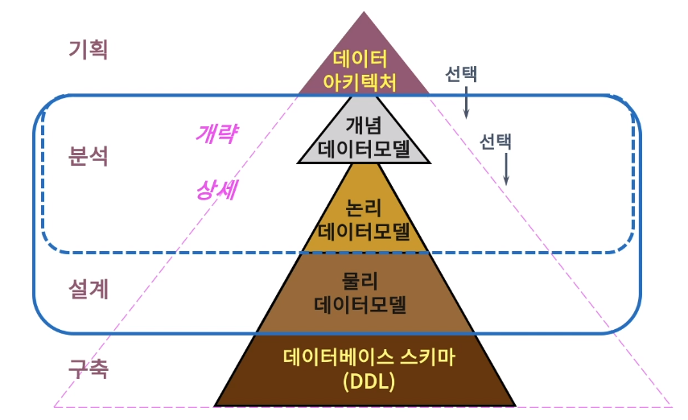
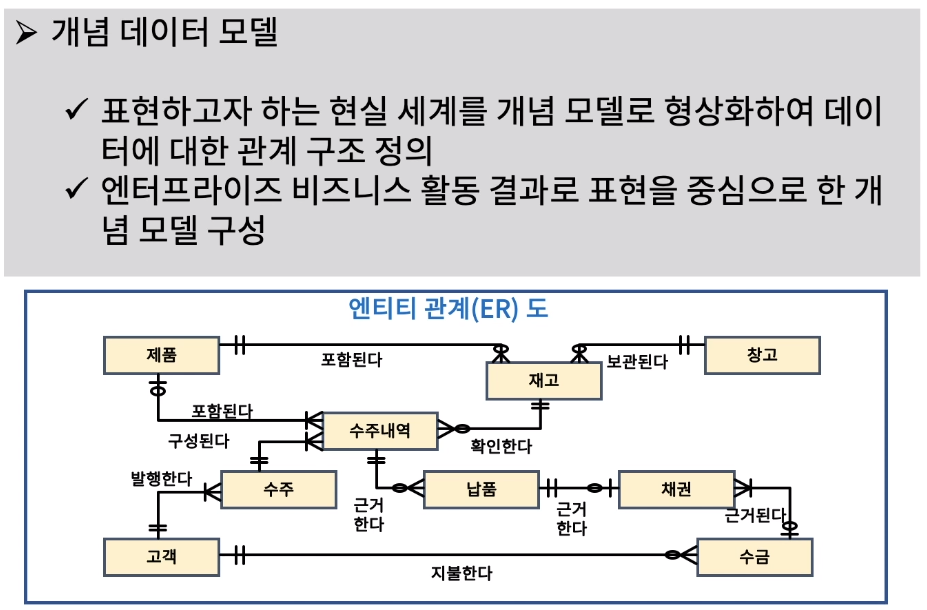
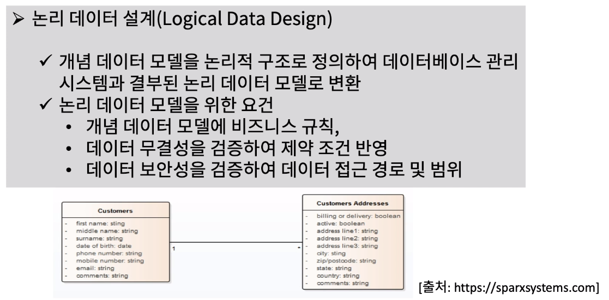
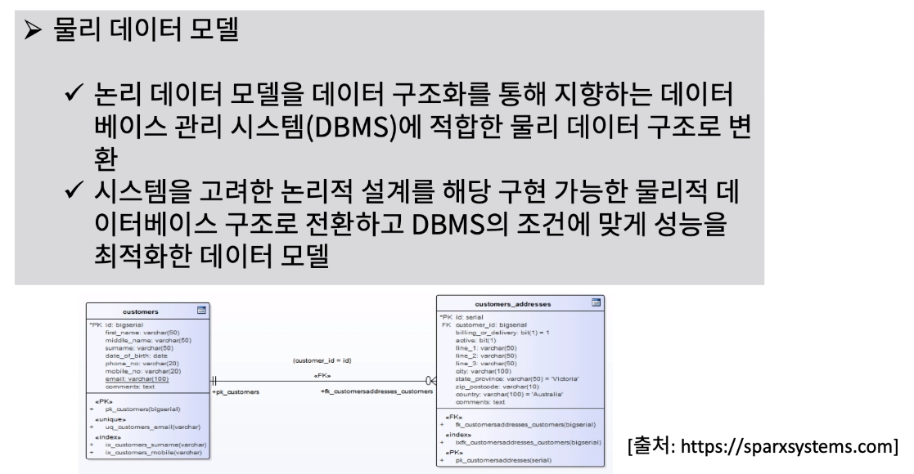

[toc]

# 개념, 논리, 물리 데이터 모델 구별

## :heavy_check_mark: 데이터 아키텍처와 개념, 논리, 물리 데이터 모델 연계

## :heavy_check_mark: 개념(Conceptual) 데이터 모델

## :heavy_check_mark: 논리(Logical) 데이터 모델

## :heavy_check_mark: 물리(Physical) 데이터 모델

