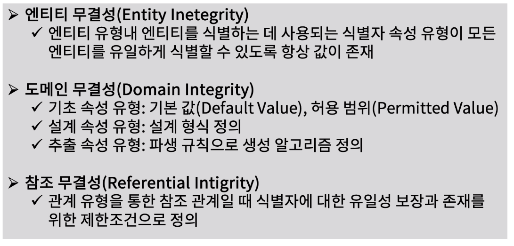
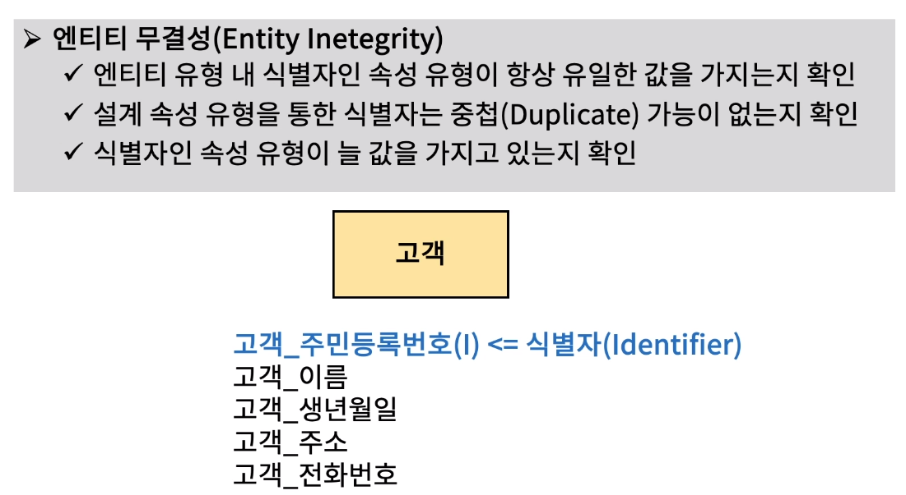
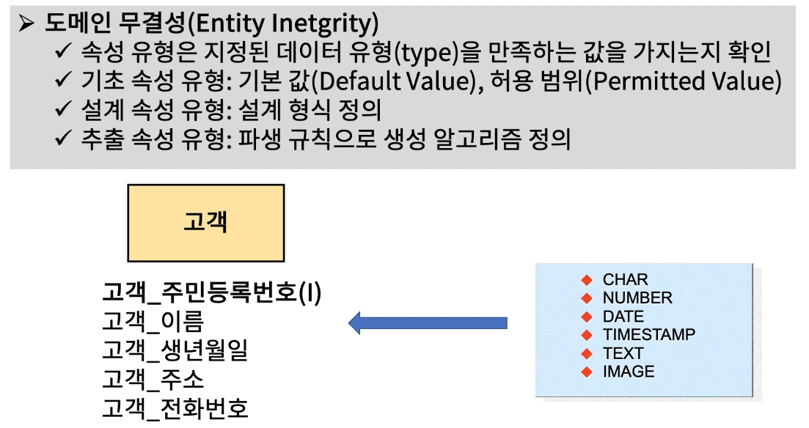
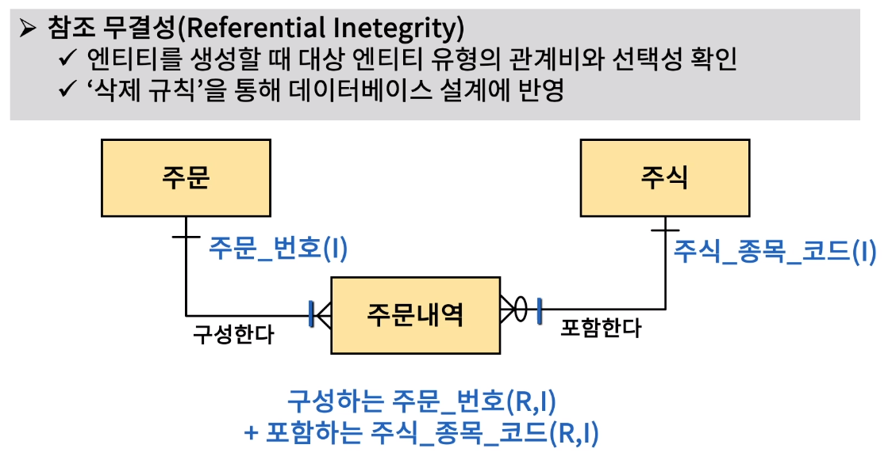
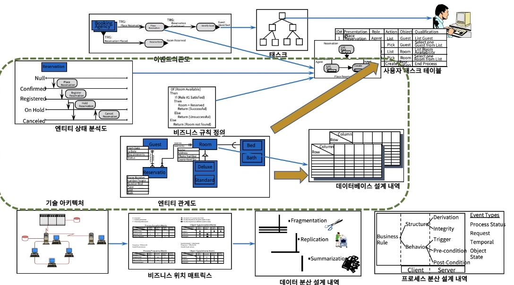

[toc]

# 데이터 무결성 검증하기

## :heavy_check_mark: 데이터 무결성(Integrity)란?

## :heavy_check_mark: 엔티티 무결성 조건

## :heavy_check_mark: 도메인 무결성 조건

## :heavy_check_mark: 참조 무결성 조건

## :heavy_check_mark: 데이터 무결성 데이터 베이스 설계 반영

