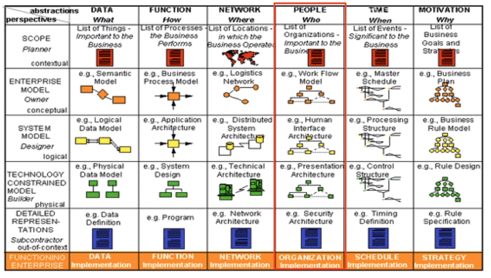
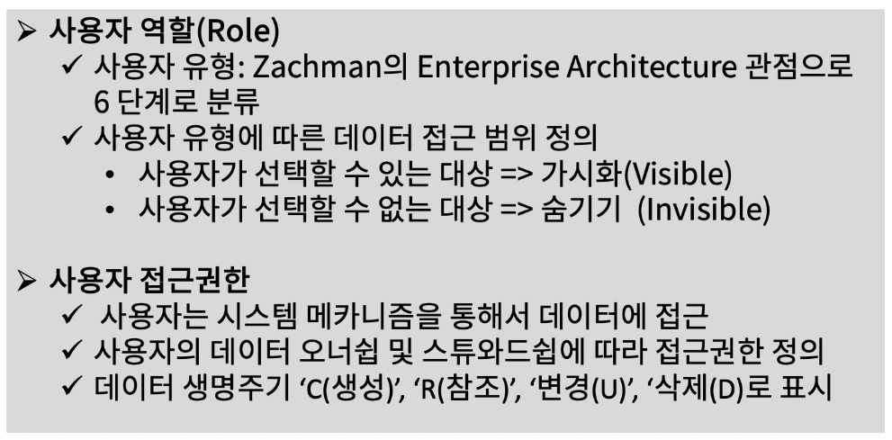
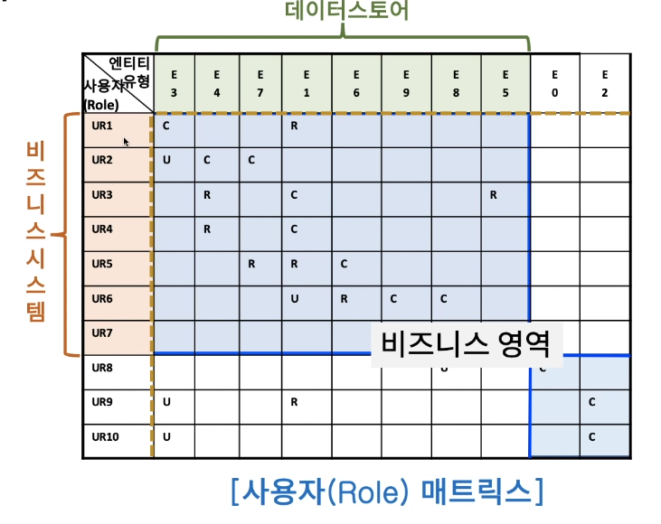
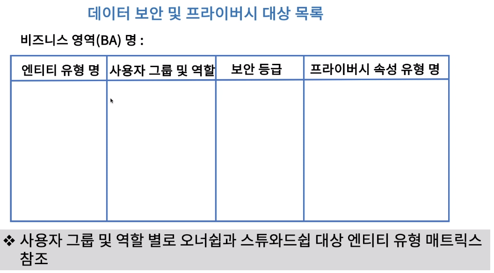
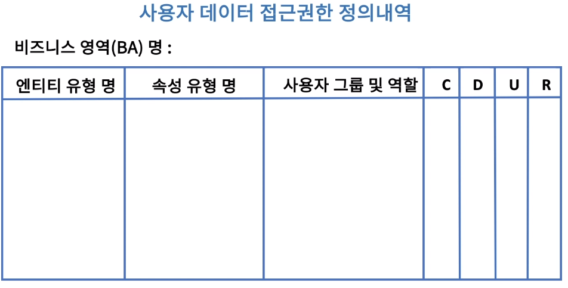

[toc]

# 데이터 보안성 검증하기

## :heavy_check_mark: 엔터프라이즈 아키텍처(EA) 사용자 관점

## :heavy_check_mark: 사용자 역할과 접근권한 분석

### 사용자 역할 분석

## :heavy_check_mark: 데이터 보안 및 프라이버시 대상 정의

## :heavy_check_mark: 사용자 데이터 접근 권한 정의

