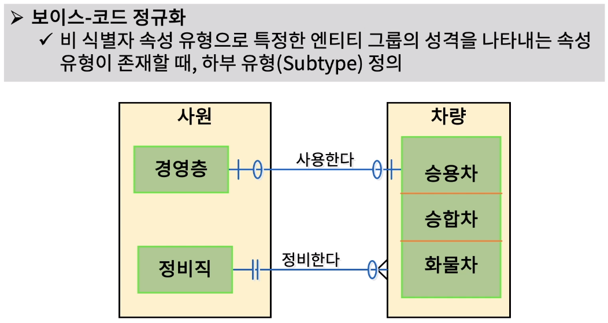

[toc]

# 1차, 2차, 3차, 4차 정규화 (Normalization)

## :heavy_check_mark: 정규화(Normalization) 목적

## :heavy_check_mark: 1차 정규화 (1st Normal Form)

## :heavy_check_mark: 2차 정규화 (2st Normal Form)

## :heavy_check_mark: 3차 정규화 (1st Normal Form)

## :heavy_check_mark: 보이스-코드 정규화 (Boyce-Codd Normal Form)

