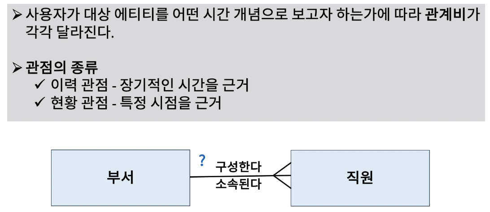
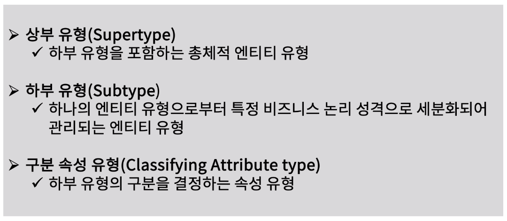
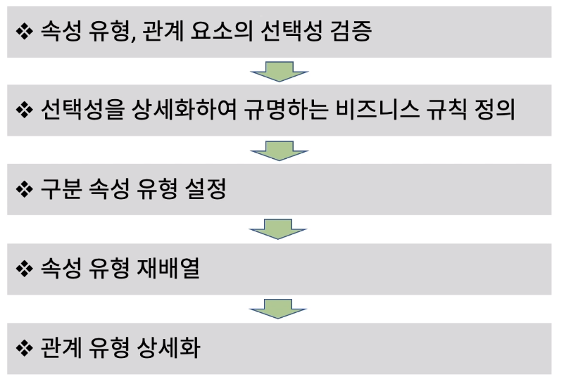
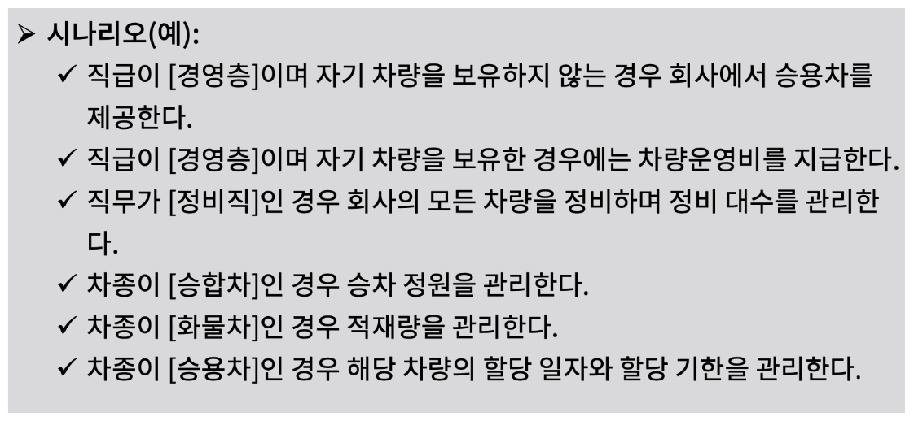
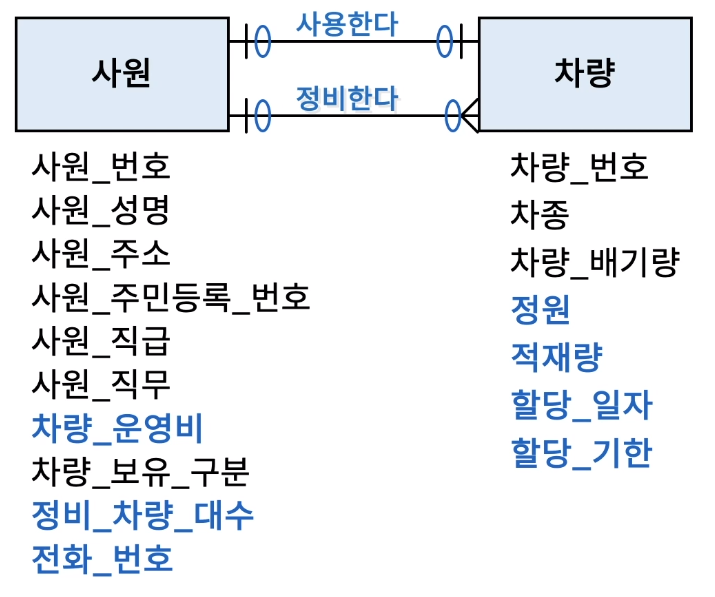
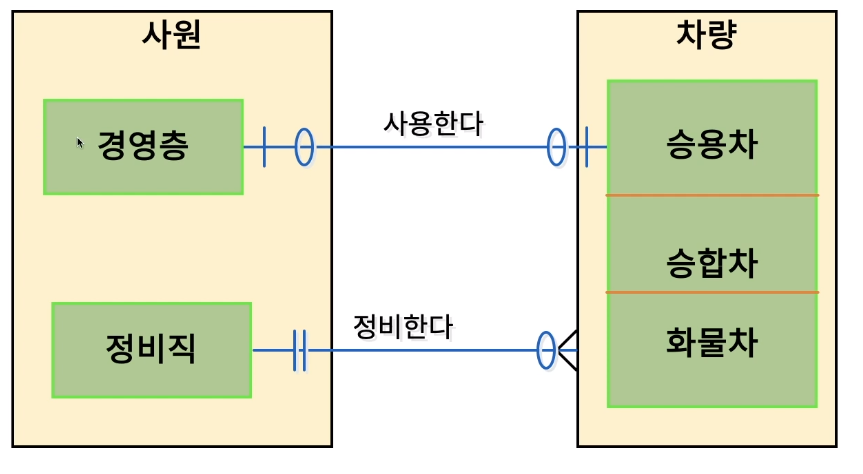

[toc]

# 정규화를 통한 데이터 모델 검증

## :heavy_check_mark: 사용자 관점과 관계비 조정

## :heavy_check_mark: 보이스-코드 정규화와 하부 유형 정의

## :heavy_check_mark: 하부 유형 정의 절차

## :heavy_check_mark: 하부 유형 비즈니스 규칙 시나리오

## :heavy_check_mark: 하부 유형 상세화 예

## :heavy_check_mark: 하부 유형 상세화 결과 예

