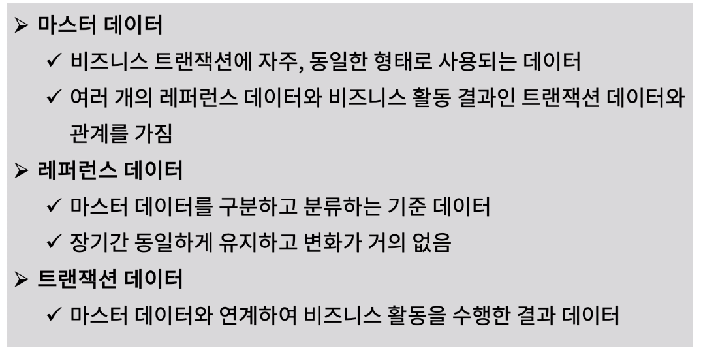
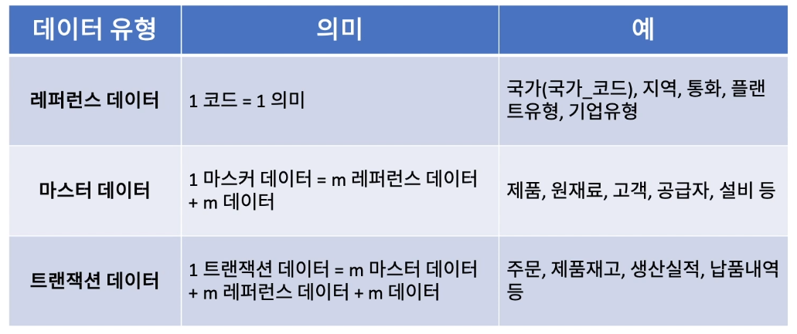
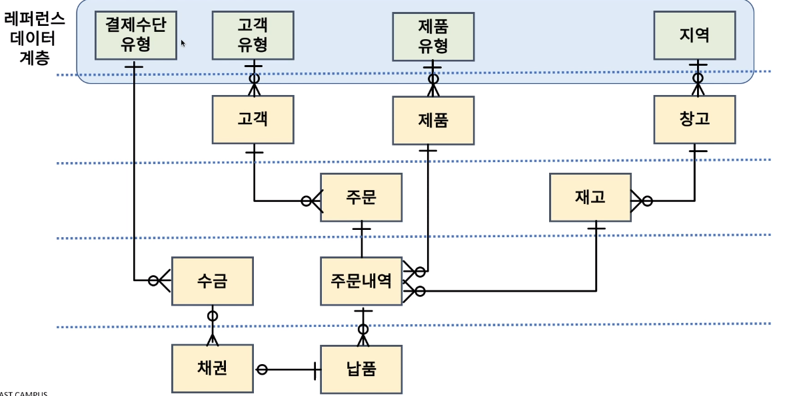
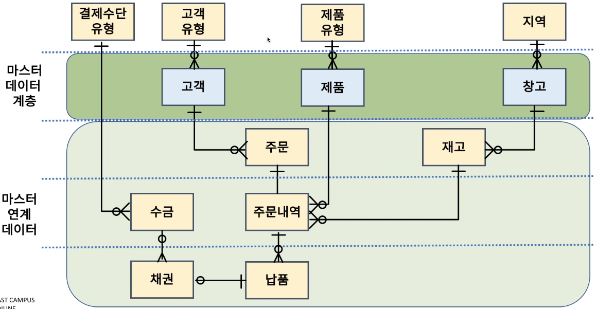
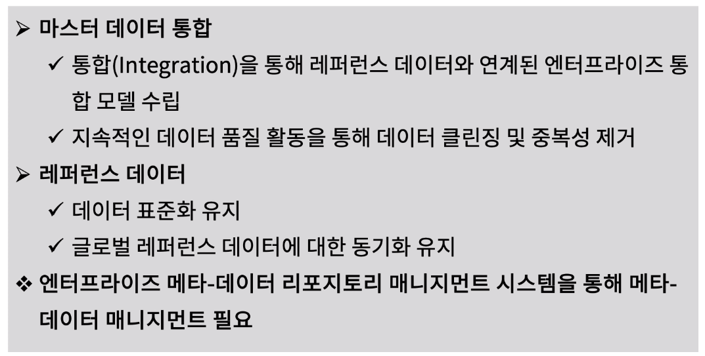

[toc]

# 레퍼런스, 마스터 데이터 식별하기

## :heavy_check_mark: 레퍼런스(Reference) 및 마스터(Master) 데이터 란?

## :heavy_check_mark: 레퍼런스(Reference) 및 마스터(Master) 데이터 특징

## :heavy_check_mark: 엔터프라이즈 통합 데이터 모델에서 레퍼런스 데이터 계층

## :heavy_check_mark: 엔터프라이즈 통합 데이터 모델에서 마스터 데이터 계층

## :heavy_check_mark: 엔터프라이즈 통합 데이터 모델에서 레퍼런스 및 마스터 데이터 매니지먼트 방안

