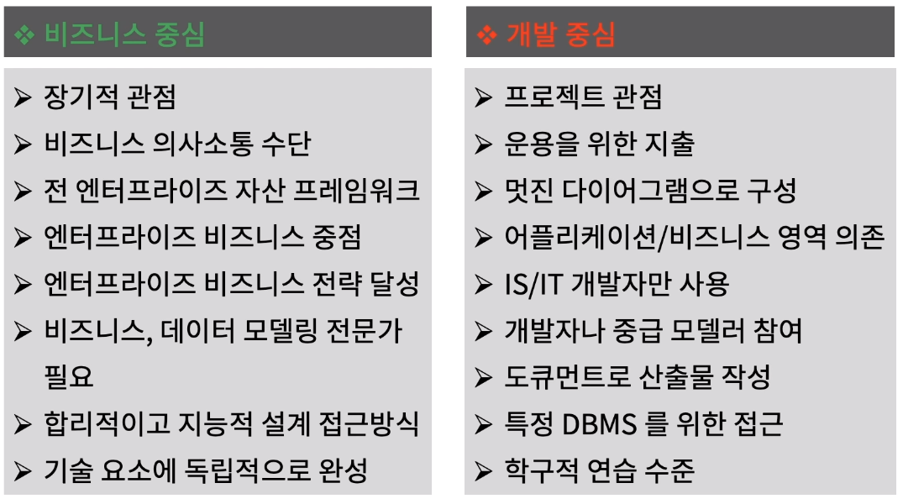
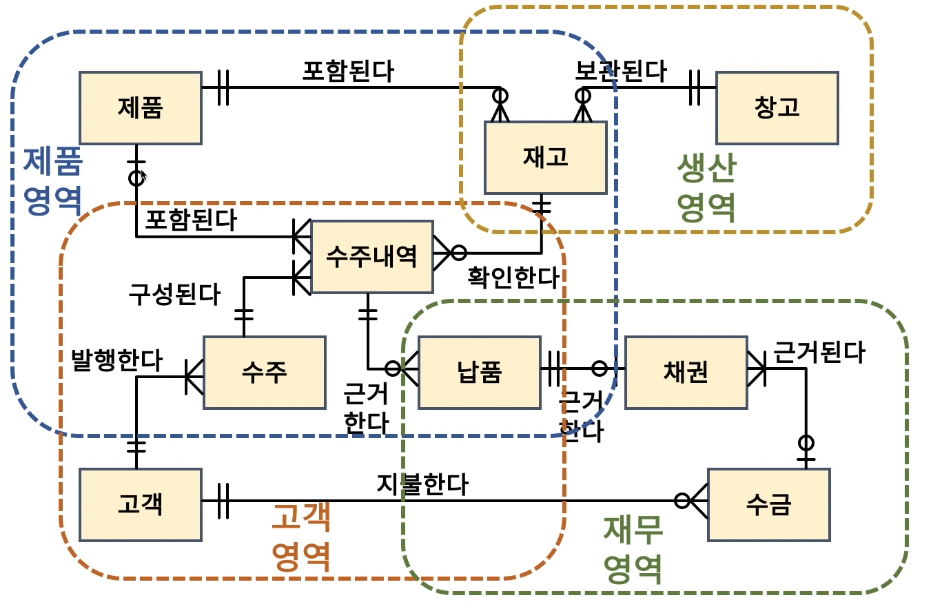
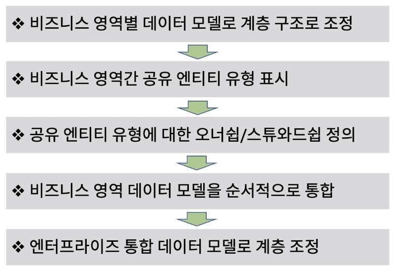
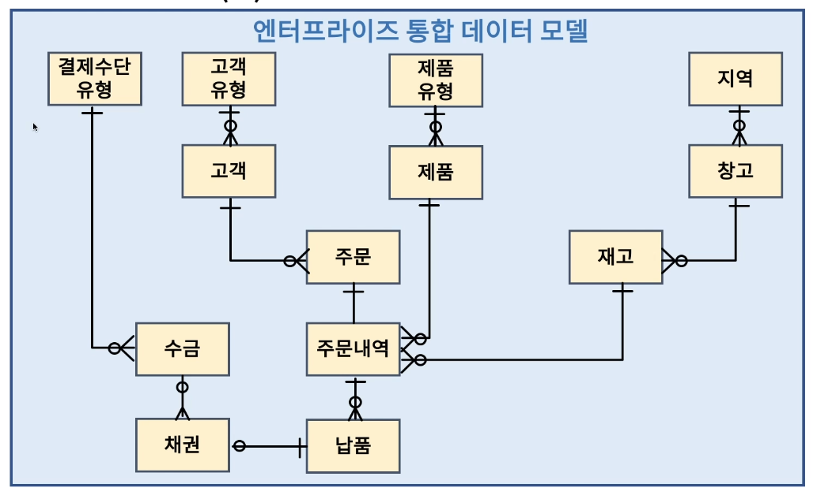

[toc]

# 업무영역 모델에서 엔터프라이즈 데이터 모델로 통합하기

## :heavy_check_mark: 엔터프라이즈 데이터 모델 의미

## :heavy_check_mark: 업무영역을 위한 데이터 모델

## :heavy_check_mark: 엔터프라이즈 데이터 모델을 위한 통합 태스트

## :heavy_check_mark: 엔터프라이즈 통합 데이터 모델 예

