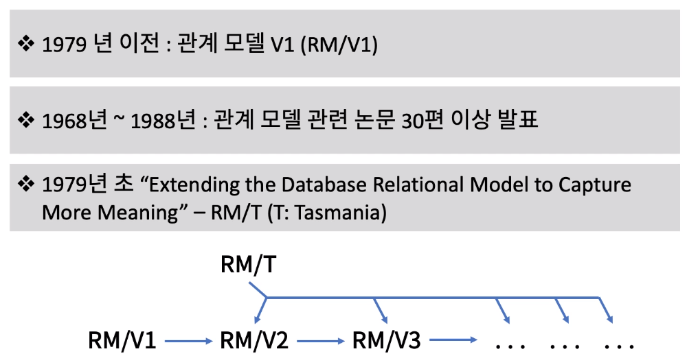
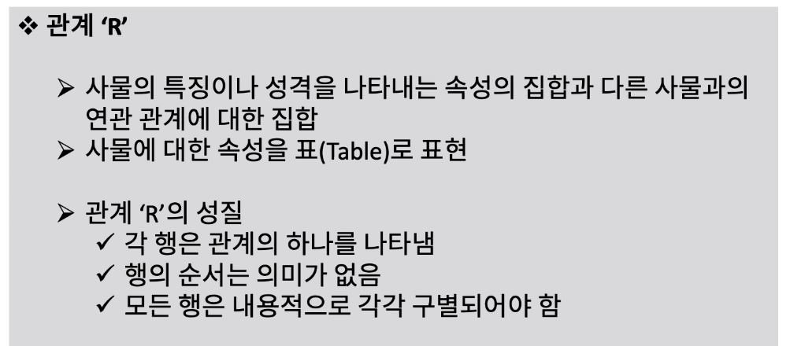
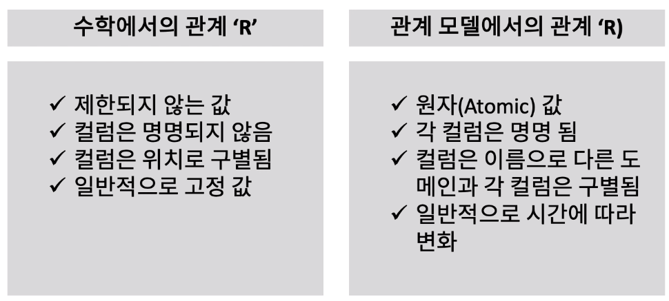
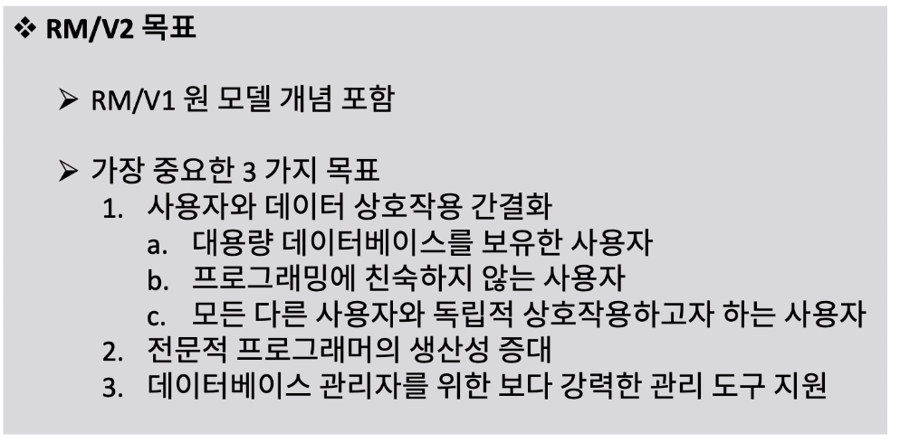
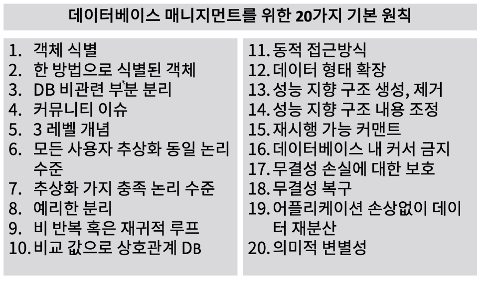

[toc]

# 관계 모델 V2 소개

## :heavy_check_mark: E. F. Codd 박사의 관계 모델(Relational Model)

## :heavy_check_mark: 관계(Relation) 'R'의 의미

## :heavy_check_mark: 수학에서의 관계 vs 관계 모델에서의 관계

## :heavy_check_mark: 관계 모델 V2(Rm/V2) 목표

## :heavy_check_mark: RM/V2: 데이터 베이스 매니지먼트를 위한 20가지 기본 원칙

