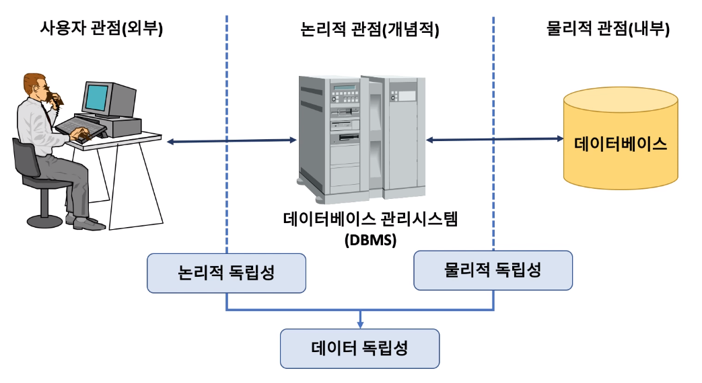
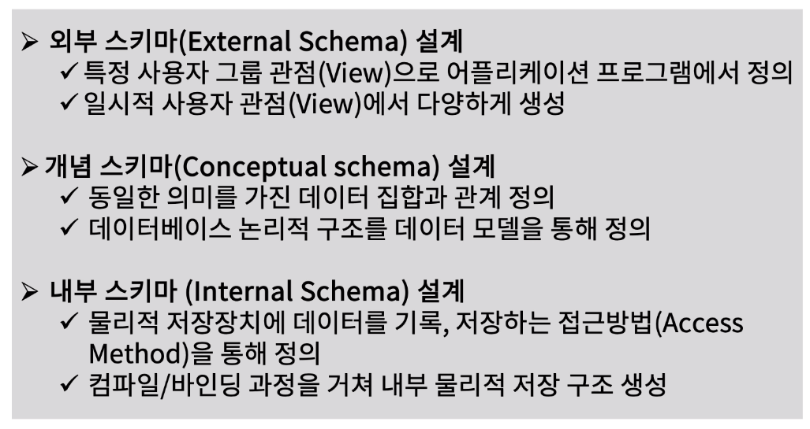

[toc]

# ANSI SPARC Schema소개

## :heavy_check_mark: 관계 (Relation) 3 레벨 아키텍처 (Architecture)

## :heavy_check_mark: ANSI/SPARC 3계층 스키마(Schema)

## :heavy_check_mark: ANSI/SPARC 3계층 스키마와 관계 3레벨 아키텍처 비교

## :heavy_check_mark: ANSI/SPARC 3계층 스키마 의미 - 데이터 독립성 (Data Independency)

## :heavy_check_mark: ANSI/SPARC 3계층 스키마를 통한 데이터베이스 설계

