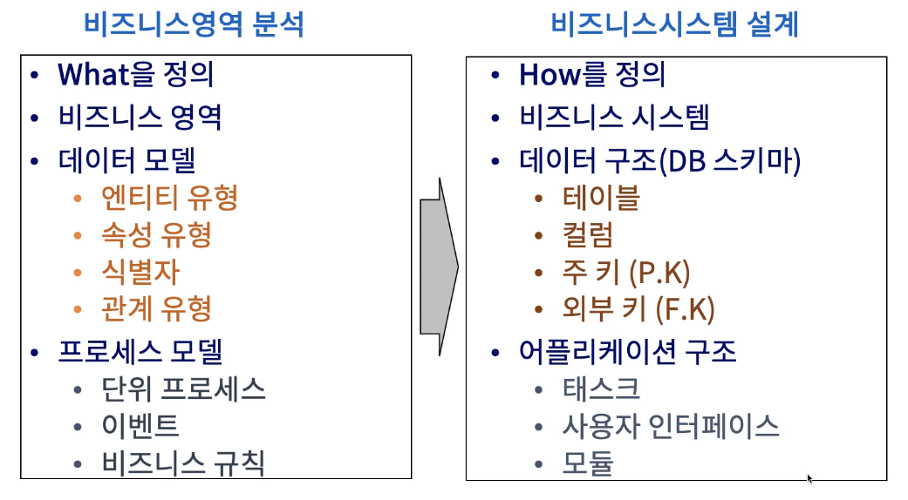
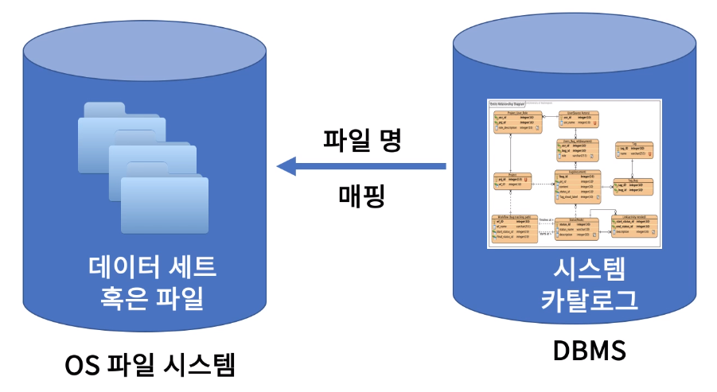
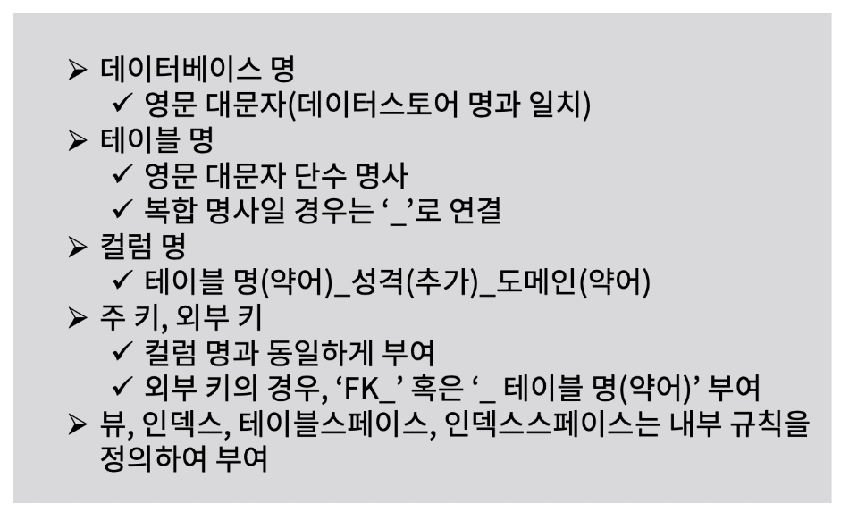
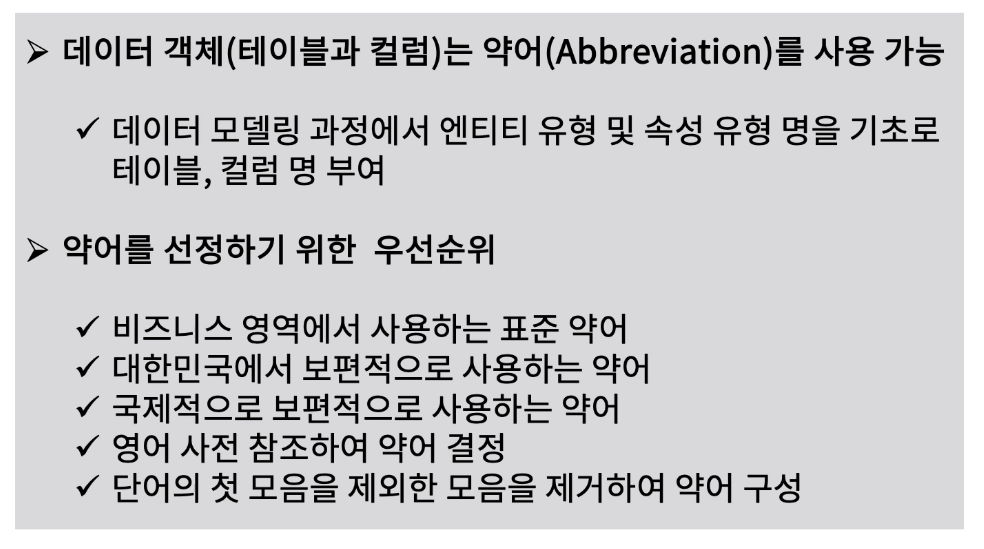

[toc]

# 데이터베이스 구성요소 명명 규칙 정의하기

## :heavy_check_mark: 데이터 모델링과 데이터베이스 설계 산출 객체 관계

## :heavy_check_mark: 데이터베이스 객체 맵

## :heavy_check_mark: 데이터베이스 구성요소 종류

## :heavy_check_mark: 데이터베이스 구성요소 명명 규칙

## :heavy_check_mark: 데이터 베이스 구성요소 명명시 약어 사용 규칙

