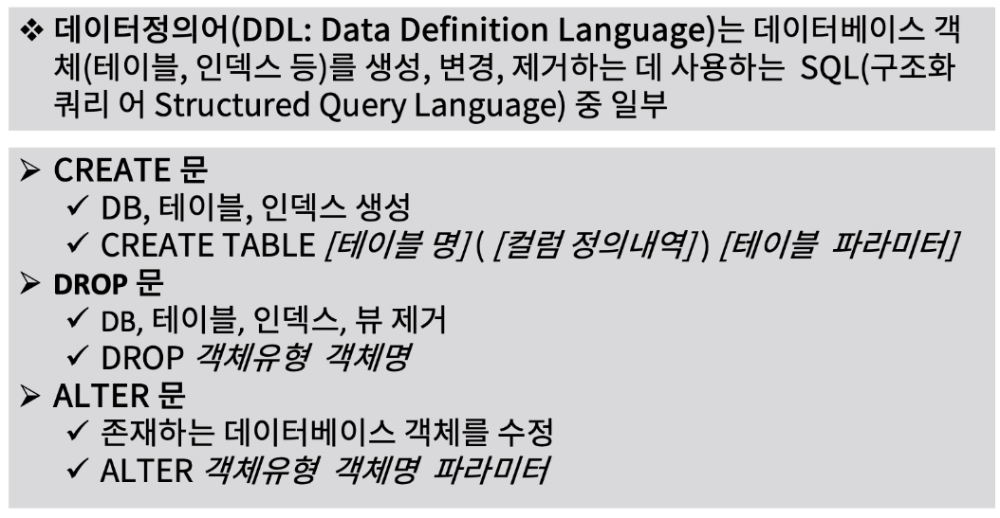
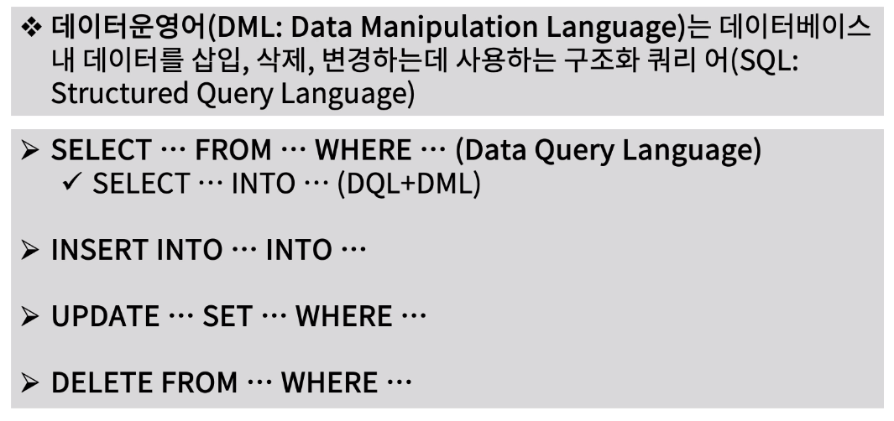
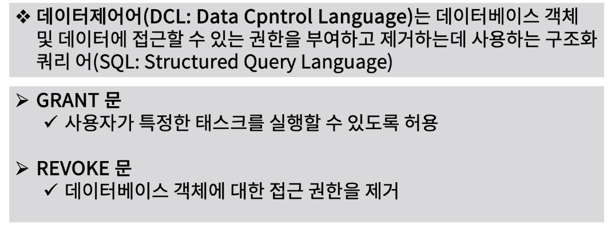
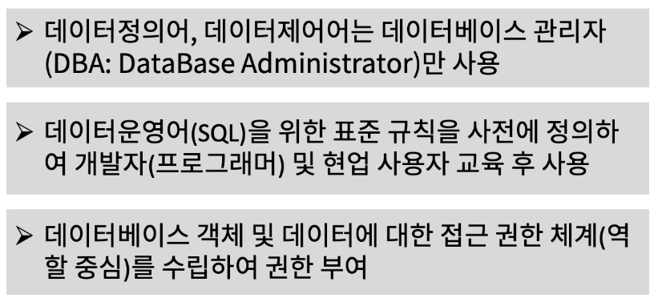

[toc]

# 데이터 정의어(DDL)과 데이터운영어(DML)

## :heavy_check_mark: 데이터정의어 (DDL)란?

## :heavy_check_mark: 데이터운영어(DML) 란?

## :heavy_check_mark: 데이터제어어(DCL) 란?

## :heavy_check_mark: 데이터정의어, 데이터운영어, 데이터제어어 사용 규칙

