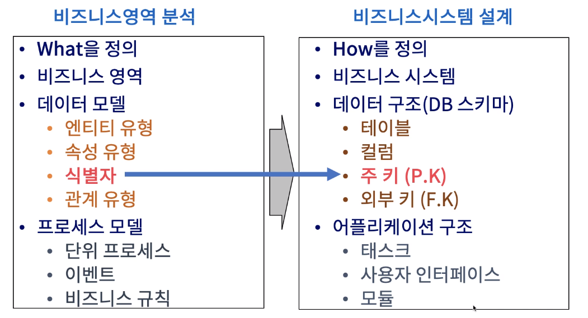
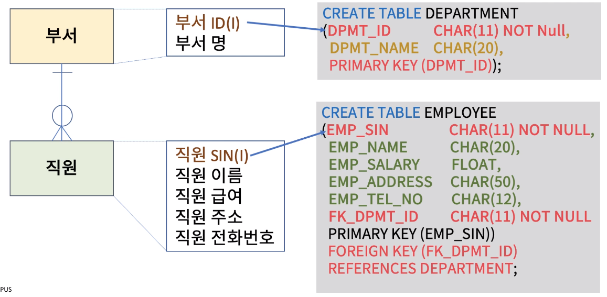
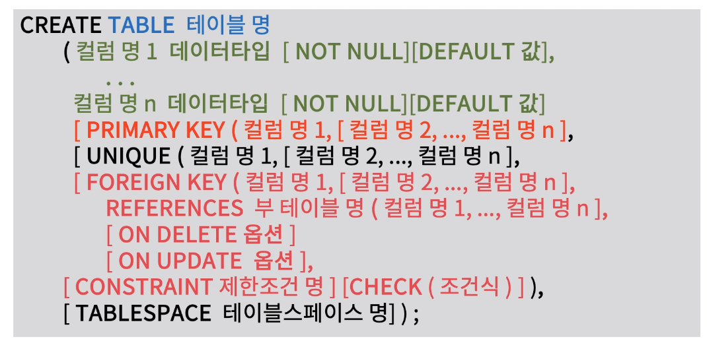
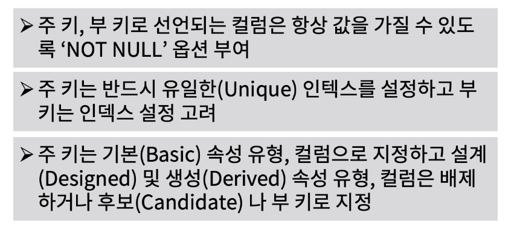

[toc]

# 주키, 부키 구성

## :heavy_check_mark: 식별자와 주 키 (Primary Key) 매핑

## :heavy_check_mark: 식별자를 주 키로 정의

## :heavy_check_mark: 주 키, 부 키 (Alternate Key) 구성 정의문

## :heavy_check_mark: 주 키, 부 키 구성 시 고려사항

