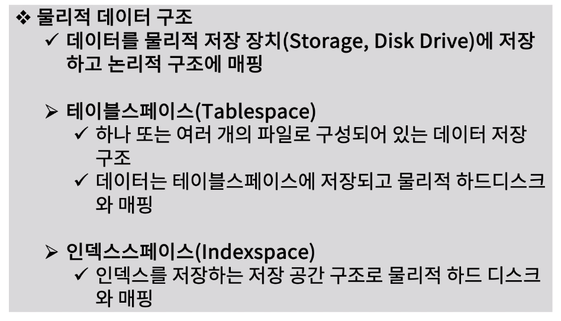
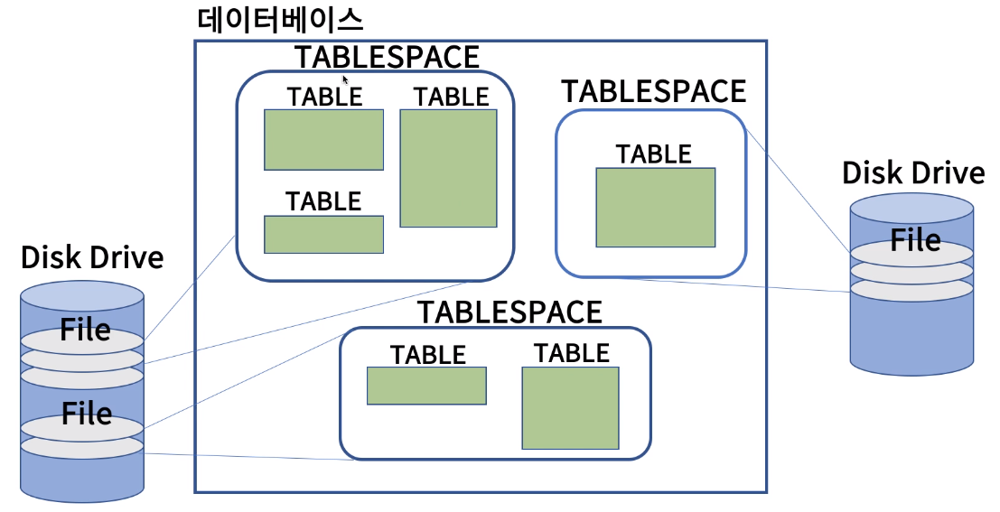
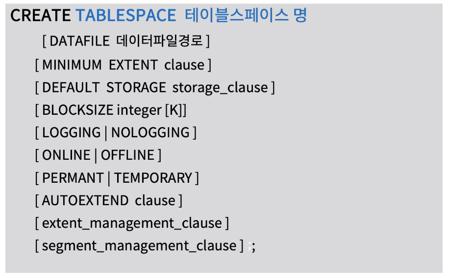
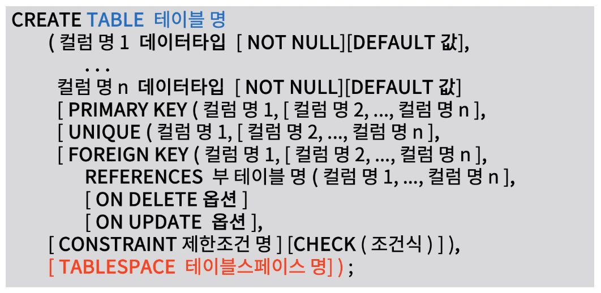
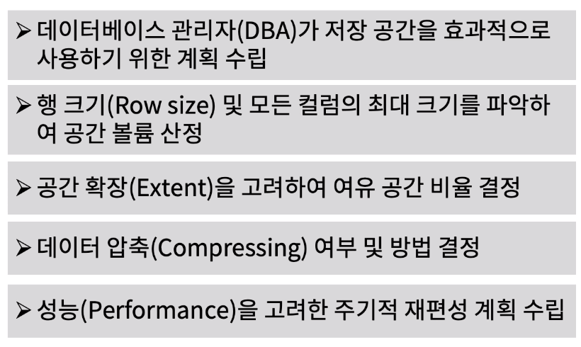

[toc]

# 물리적 데이터 구조 완성하기

## :heavy_check_mark: 물리적 데이터 구조 설계

## :heavy_check_mark: 파일을 데이터베이스 구조로 매핑

## :heavy_check_mark: 테이블 스페이스 생성 정의 문 

테이블스페이스

## :heavy_check_mark: 테이블 생성 정의문에서 테이블스페이스 사용

## :heavy_check_mark: 테이블스페이스, 인덱스 스페이스 구성 시 고려사항

