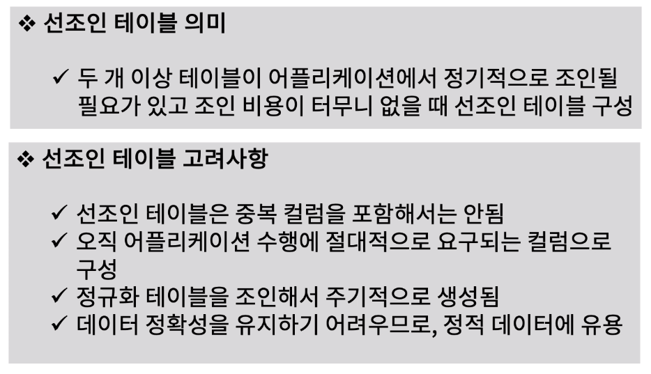
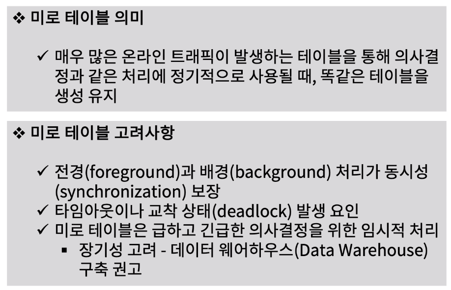
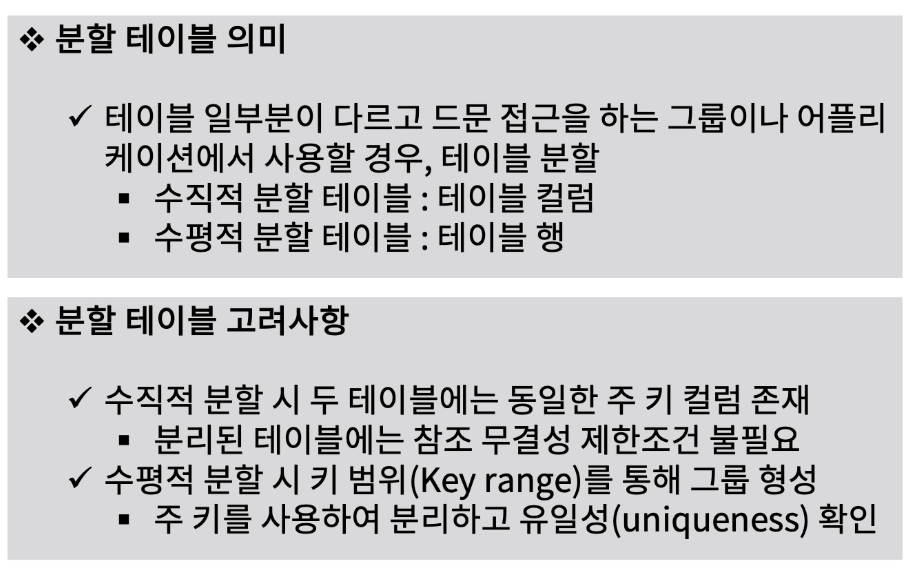
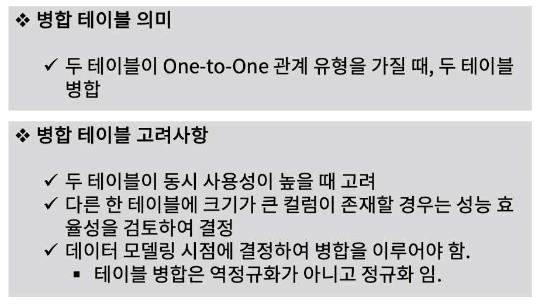

[toc]

# 선조인(prejoin) 테이블, 미로 테이블, 분할 테이블, 병합 테이블 설계하기

## :heavy_check_mark: 선조인(prejoin) 테이블 설계 방안

## :heavy_check_mark: 미로(Mirror) 테이블 설계 방안 

## :heavy_check_mark: 분할(Split) 테이블 설계 방안

## :heavy_check_mark: 병합(Combind) 테이블 설계 방안

