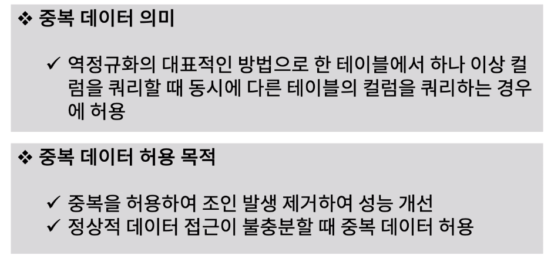
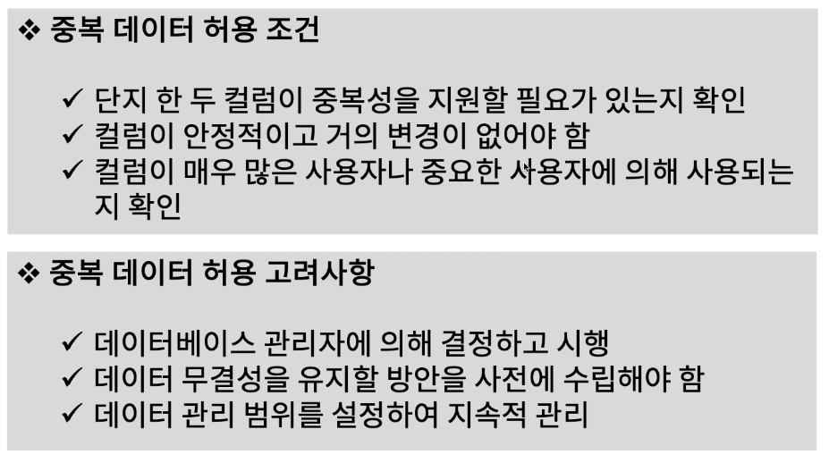
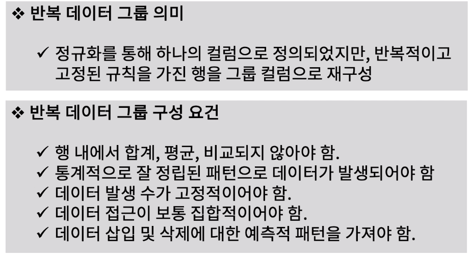
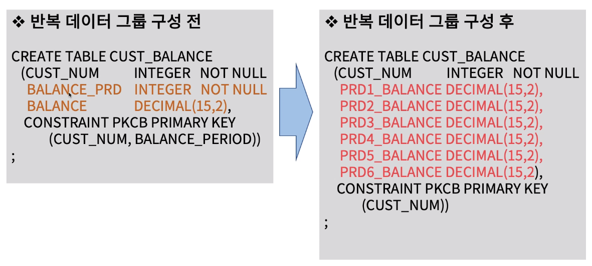

[toc]

# 데이터 중복성 관리하기

## :heavy_check_mark: 중복(Redundant) 데이터 란?

## :heavy_check_mark: 중복 데이터 허용 조건 및 고려사항

## :heavy_check_mark: 반복(Repeating) 데이터 그룹이란?

## :heavy_check_mark: 반복 데이터 그룹 구성 예

