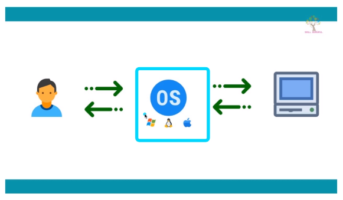
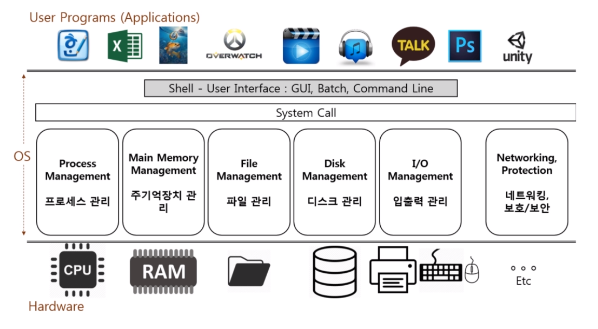

[toc]

# 운영체제 큰 그림

## :heavy_check_mark: 운영체제 역할

### 1. 시스템 자원(System Resource) 관리자

- 운영체제는 Operating System 또는 OS라고 부른다.

- **시스템 자원 = 컴퓨터 하드웨어**

  - CPU (중앙 처리 장치), Memory (DRAM, RAM)
  - I/O Devices (입출력장치)
    - Monitor, Mouse, Keyboard, Network
  - 저장 매체: SSD, HDD

  

### 2. 사용자와 컴퓨터 간의 커뮤니케이션 지원

### 3. 컴퓨터 하드웨어와 프로그램을 제어

- 응용프로그램과 하드웨어 관리

## :heavy_check_mark: 하드웨어는 스스로 할 수 있는 것이 없다.

- CPU: 각 프로그램이 얼마나 사용할지 스스로 결정할 수 없다.
- Memory: 각 프로그램이 어느 주소에 저장되어야 하는지, 어느 정도의 메모리 공간을 확보해야 하는지 스스로 결정 할 수 없다.
- 입 출력 장치 (키보드, 마우스):  스스로 표시 할 수 없음
- 저장매체 (SSD, HDD): 어떻게 어디에 저장할지 스스로 결정 할 수 없다. 

>결정할 운영체제가 필요함!

 

## :heavy_check_mark: How did we ever run Computer without OS?

- OS없이 하드웨어는 동작하지 않음~

## :heavy_check_mark: 대표적인 운영체제

- Windows OS
- Mac OS
- UNIX OS
  - UNIX 계열 OS: UNIX와 사용법이나, OS 구조가 유사한 OS들
  - LINUX OS

> OS는 만들기 쉽지 않다.  ex) TmaxOS, Windows OS 초창기 시연

