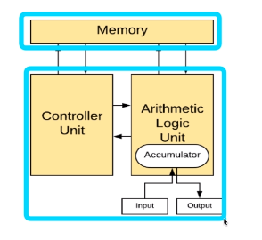

[toc]

# 운영체제 큰 그림과 응용 프로그램

## :heavy_check_mark: 응용 프로그램 (Application, App) 이란?

- 프로그램 = 소프트웨어
- 소프트웨어 = 운영체제, 응용 프로그램 (엑셀, 파워포인트, 우리가 만드는 프로그램 .. 등)

## :heavy_check_mark: OS와 Application간의 관계

### 1. OS는 **Application**을 관리

- Application 실행
- Application **권한** 관리
  - ex) 관리자 권한으로 실행 
- Application을 사용하는 **사용자** 관리
  - PC 로그인

### 2. 시스템 자원 (System Resource) 관리, 효율적 분배

- Application은 누구나 만들 수 있다.
  - Application에 무한 반복문을 넣었다? > 자원 계속 잡아먹음 > Application 강제 종료 > OS가 관리
  - 모든 파일 삭제 막기 등 권한 관리
  - Application이 CPU를 많이 쓴다? > 비정상적인 동작 막음

### 3. 사용자와 컴퓨터간의 커뮤니케이션 지원

> OS 목표: 사용자가 사용하는 Application이 효율적으로, 적절하게 동작하도록 지원
>
> OS는 Application이 요청하는 시스템 리소스를 효율적으로 분배하고 지원하는 소프트웨어

## :heavy_check_mark:  운영체제는 어디에 있을까~?

> 운영체제는 저장매체 (SSD/HDD)에 저장(설치)됨

## :heavy_check_mark: 컴퓨터 구조 복습

- 컴퓨터 키면 -> 운영체제는 Memory에 올라가게 된다.

  참고: 폰노이만 구조

  

