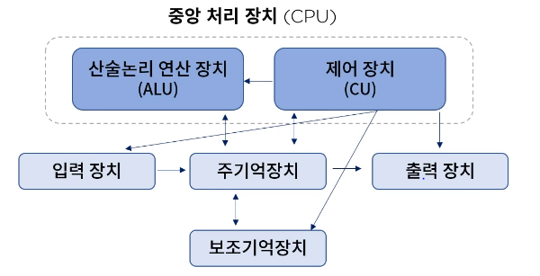
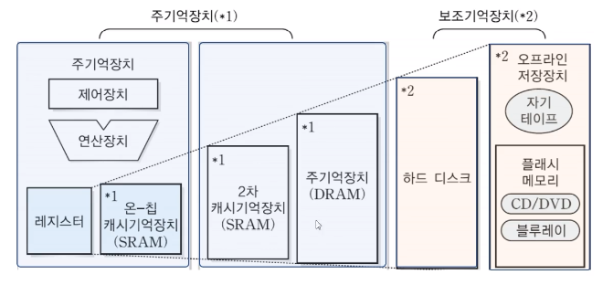
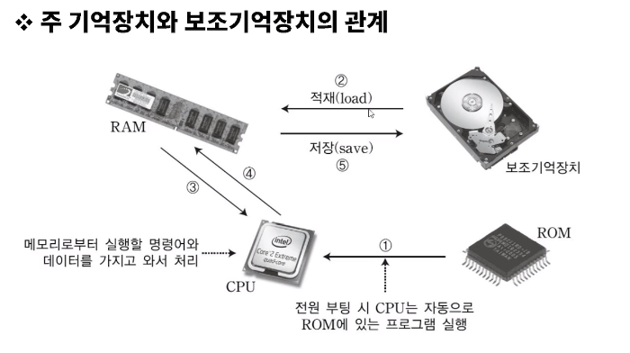

[toc]

# 컴퓨터 구성요소의 인지와 기능의 조합

## :heavy_check_mark: 중앙 처리 장치 (Central Processing Unit)

### CPU

- 마더 보드: 데이터의 전달 통로가 디자인 되어있는 메인 보드

- 실행 프로그램의 명령 해석, 실행, 장치제어 , ALU, CU, 각종 레지스터로 구성

  

  

 

### MPU(Micro Processing Unit-CPI)

- CPI를 LSI(고밀도 집적회로)화 한 일종의 통합 장치

- CISC/RISC (Complex/Reduced Instruction Set Computer)

  - CISC: 연산을 처리하는 복잡한 명령어들을 수백개 이상 탑재하고 있는 프로세서
  - RISC : 핵심적인 명령어를 기반으로 최소한의 명령어 세트를 구성

  > [RISC 와 CISC 구조](https://frontalnh.github.io/2018/04/17/%EC%BB%B4%ED%93%A8%ED%84%B0-%EA%B5%AC%EC%A1%B0-risc-%EC%99%80-cisc-%EA%B5%AC%EC%A1%B0/)

- Bit Slice MPU 등이 존재한다.

- **컴퓨터의 핵심 기능인 주어진 기계어를 해석하고, 연산을 수행하는 기능만 가지고 있는 프로세서**. 
- MPU는 주변에 RAM, ROM , I/O 등의 장치를 추가해주지 않으면 작동을 하는 것이 불가능합니다.
- 연산 위주 작업에 집중

> [프로세서, CPU, MPU, MCU, 코어의 개념과 차이](http://melonicedlatte.com/computerarchitecture/2019/10/15/143300.html)

 

### 사물 인터넷 디바이스 H/W 플랫폼 종류

- 아두이노, 오픈 소스 하드웨어 플랫폼, Raspberry Pi. Galileo, Edison, ...

## :heavy_check_mark: 주변장치(Peripheral Device)

### 기억장치(Memory unit)

- Ram (Random Access Memory): 휘발성 메모리로, 작업 중인 파일을 한시적으로 저장

  - DRAM (Dynamic RAM)

    - 동적 메모리

    - 전원이 계속 공급되더라도 **주기적으로 재충전**되어야 기억된 내용을 유지할 수 있다.

    - 회로가 비교적 간단하고 가격이 저렴하다.

    - 집적도가 높기 때문에 대용량의 기억장치에 주로 사용된다.

    - - 집적도가 높다 : 같은 용량이면 더 많은 데이터를 저장가능.

    - **DRAM이나 SRAM은 전원이 꺼지면 자료를 계속 보존할 수 없다.**

    - DRAM은 충전기 캐패시터에 전하를 저장하는 방식으로 2진 데이터를 저장한다.
      충전기에 전하가 존재하는지에 따라 2진수의 0과 1로 구분한다.
      캐패시터에 충전된 전하는 시간이 지남에 따라 조금씩 방전되어 기억된 정보가 없어질 수 있다.

  - SRAM (Static RAM)

    - 정적 메모리
    - 전원 공급이 되는 동안은 기록된 내용이 지워지지 않기 때문에 재 충전(Refresh)가 필요 없다.
    - 가격이 비싸다는 단점이 있다.
    - 접근 속도가 빨라 **캐시 메모리**로 사용된다.
    - 구조가 복잡하고 소비전력이 많이 필요하다.
    - 전원이 꺼지면 저장된 자료를 계속 보존할 수 없는 기억장치이다.

  > [DRAM SRAM](http://itnovice1.blogspot.com/2019/09/sram-dram.html)

- ROM (Read Only Memory): 컴퓨터에 지시사항을 영구히 저장하는 비휘발성 메모리, 외부에 있는 프로그램을 불러오는 장치같은 느낌

 

### 보조 기억장치(Auxiliary memory device)

- 저속, 저렴, 다량의 데이터 저장

  

  

- 그 외 보조 기억장치

  - 플래시 기억장치 (EEPROM의 한 종류 - RAM과 ROM의 중간위치)
    - CF
    - SSD
  - USB
  - SD card
  - 메모리 스틱

 

### 입/출력 장치 (I/O device)

- 키보드
- 마우스
- 스캐너
- 터치스크린
- 조이스틱
- ...

