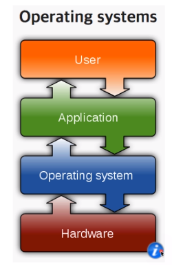
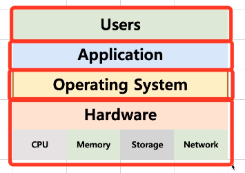
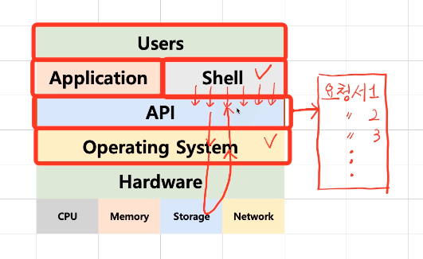
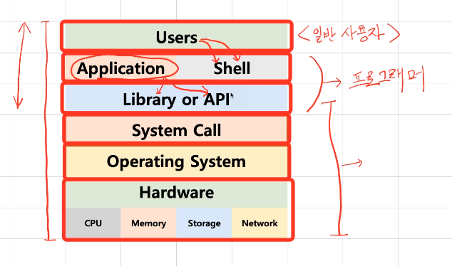

[toc]

# 운영체제 구조 - 시스템 콜

## :heavy_check_mark: 관계

### 응용 프로그램, 운영체제, 컴퓨터 하드웨어 관계

- OS는 Application이 요청하는 메모리를 허가하고 분배한다.
- OS는 Application이 요청하는 CPU 시간을 제공한다.
- OS는 Application이 요청하는 IO Devices 사용을 허가 제어 한다.

### 사용자, 응용 프로그램, 운영체제, 컴퓨터 하드웨어 관계

## :heavy_check_mark: OS는 사용자 Interface 제공

- 쉘 (Shell)

  

  - 사용자가 OS 기능과 서비스를 조작할 수 있도록 인터페이스를 제공하는 프로그램
  - 쉘은 터미널 환경 (CLI)과, GUI환경 두 종류로 분류 된다.

## :heavy_check_mark: OS는 응용 프로그램을 위해서도 인터페이스를 제공

### API (Application Programming Interface)

- 함수로 제공  ex) `open()`

- API로 Shell에서 요청해서 사용

  

### 보통은 라이브러리 (library) 형태로 제공

- C library 

### 시스템 콜

- 시스템콜 또는 시스템 호출 인터페이스
- OS가 각 기능을 사용할 수 있도록 시스템 콜이라는 명령 또는 함수를 제공
- API 내부에는 시스템콜을 호출하는 형태로 만들어지는 경우가 대부분

## :heavy_check_mark: 운영체제를 만든다면?

### 1. 운영체제를 개발한다. (kernel)

### 2. 시스템콜 개발

### 3. C API (library) 개발

### 4. Shell 프로그램 개발

### 5. 응용 프로그램 개발

## :heavy_check_mark: 운영체제와 시스템콜

- 시스템콜 정의 ex) [POSIX API](https://ko.wikipedia.org/wiki/POSIX), 윈도우 API
- API: 각 언어별 운영체제 기능 호출 인터페이스 함수 (각 언어별 인터페이스)

- 시스템콜: 운영체제 기능을 호출하는 함수

## :heavy_check_mark: 정리

- 운영체제는 컴퓨터 하드웨어와 응용 프로그램을 관리한다.
- 사용자 인터페이스를 제공하기 위해 쉘 프로그램을 제공한다.
- 응용 프로그램이 운영체제 기능을 요청하기 위해서, 운영 체제는 시스템콜을 제공한다.
  - 보통 시스템 콜을 직접 사용하기 보다는, 해당 시스템 콜을 사용해서 만든 각 언어별 라이브러리(API)를 사용한다.

