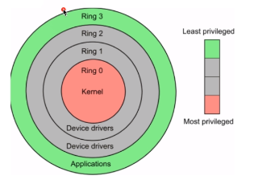
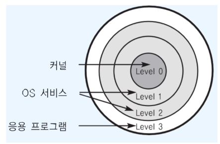
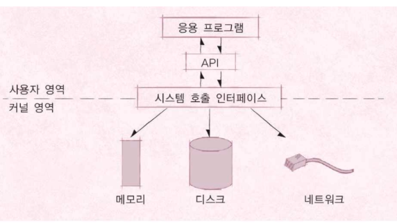
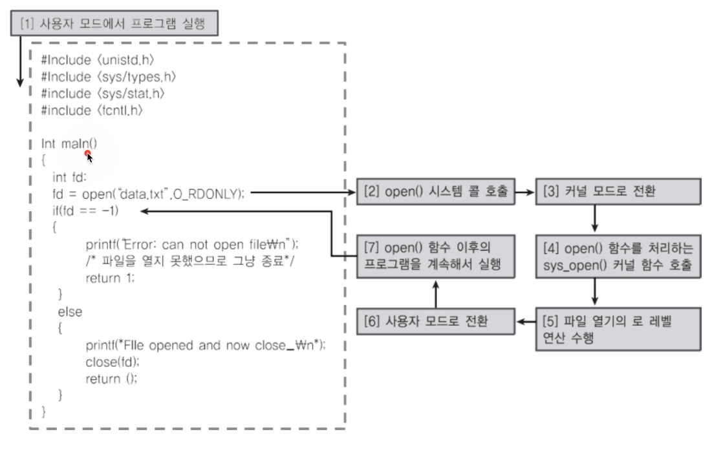
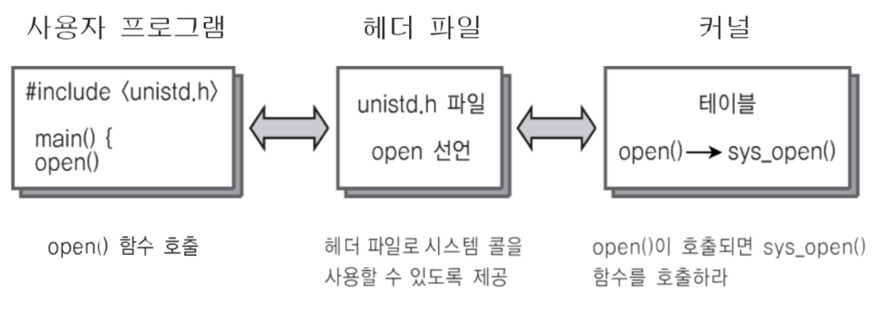

[toc]

# 운영체제 구조 - 사용자모드와 커널모드

## :heavy_check_mark: CPU Protection Rings

- CPU도 권한 모드라는 것을 갖고있다. 

  - 사용자 모드 (user mode by Application)

  - 커널 모드 (kernel mode by OS): 특권 명령어 실행과 원하는 작업 수행을 위한 자원 접근을 가능하게 하는 모드

    > Kernel 이란?
    >
    > - OS 본연의 기능
    > - 핵심 소프트웨어

    > Shell 이란?
    >
    > - Kernel의 껍데기

    

    > intel cpu 기준

    

    대부분 운영체재는 Ring3(사용자 모드) Ring0(커널 모드) 사용

 

### 사용자 모드 (User mode): 응용 프로그램이 사용

### 커널 모드 (Kernel mode): OS가 사용

- 특별한 권한을 필요로함

## :heavy_check_mark: 응용프로그램과 운영체제

> 실제로 응용프로그램에서 API 호출로 메모리에 접근할때 커널영역을 거쳐서 감
>
> ex) 
>
> 1. 1~1000까지 더하고 (**사용자 모드**)
> 2. 파일에서 데이터 가져와서 (**시스템 콜을 통해** OS영역 디스크에서 가져와야함 - **커널모드을 통해 실행**)
> 3. 해당 데이터와 1~1000까지 더한 값을 다시 더한 뒤 출력한다.

 

### - 시스템 콜은 커널 모드로 실행

* 시스템콜을 사용하는 순간 커널 모드로 실행함
* **커널 모드에서만 실행 가능한 기능**들이 있음
* (응용 프로그램이 사용하려면) 커널 모드로 실행하려면, **반드시 시스템 콜을 사용**해야함(거쳐야함)
* 시스템 콜은 **운영체제가 제공** (OS에서 구현)

## :heavy_check_mark: 사용자 모드와 커널 모드 나누는 이유

- 함부로 응용 프로그램이 전체 컴퓨터 시스템을 헤치지 못함
- ex) **등본 발급(특별한 명령어)**하려면 꼭 동사무소에서 **특별한 신청서(시스템 콜)** 를 써서 동**사무소 직원이 특별한 권한(커널모드)**을 가지고 등본을 출력해서 줌

- 응용 프로그래머
  - 사용자 프로그램 ex) API를 사용해 응용 프로그램 개발
- 시스템 프로그래머
  - 운영 체제 및 시스템 프로그램(Shell, API, System call)등 개발
  - 하드 웨어까지..

## :heavy_check_mark: 예제

> open() (library) -> OS가 관리하는 file 저장매체에 접근하는 함수

## :heavy_check_mark: 정리

- 운영체제는 **시스템 콜** 제공

- 프로그래밍 언어별로 운영체제 기능을 활용하기 위해, 시스템 콜을 기반으로 **API** 제공

- 응용 프로그램은 운영체제 기능 필요시, 해당 **API**를 사용해 프로그램 작성

- 응용 프로그램이 실행돼서, 

  **운영체제 기능이 필요한 API를 호출**하면, 

  **시스템 콜이 호출**돼서, 

  **커널모드로 변경되어 OS 내부에서 해당 명령이 실행**되고, 

  **다시 응용프로그램**으로 돌아간다.

