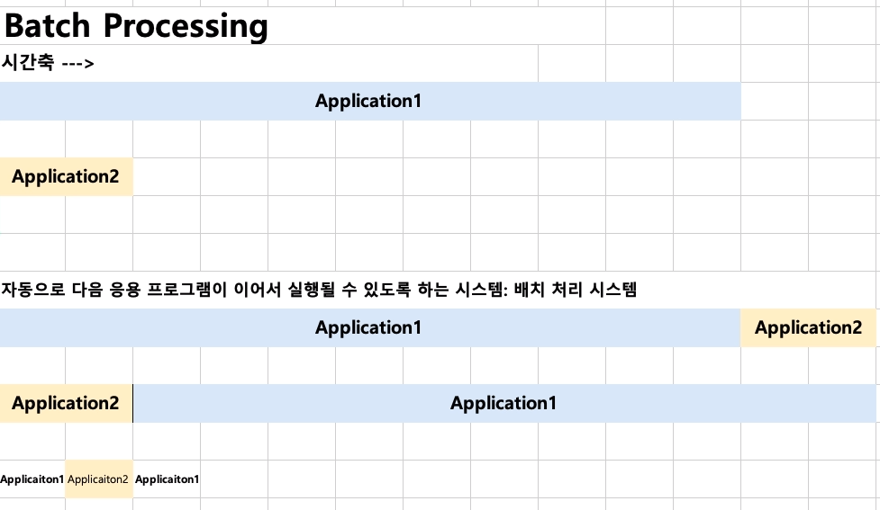
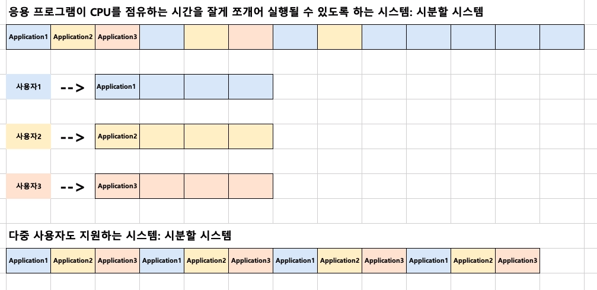
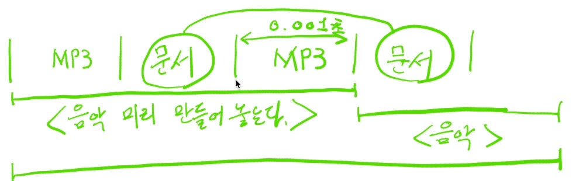
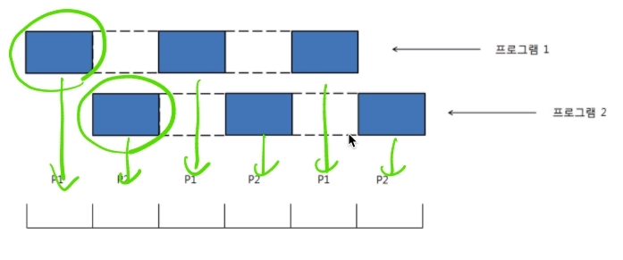
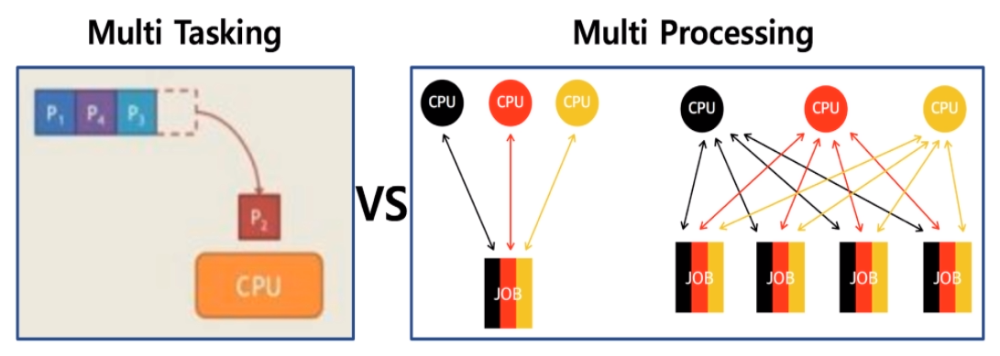

[toc]

# 프로세스(응용프로그램) 스케쥴링 

# - 배치 처리, 멀티 태스킹, 멀티프로세싱 상세

## :heavy_check_mark: 배치 처리 시스템

> **자동으로 다음 응용 프로그램이 이어서 실행될 수 있도록 하는 시스템**

> Queue 자료 구조와 비슷한 구조 (FIFO-First In First Out)

### 배치 처리 시스템 vs 시분할 시스템 / 멀티 프로그래밍

- **배치 처리 시스템 단점**

  - 여러 프로그램을 순차적으로 실행 시킬 수 있게 ?

    > 어떤 프로그램이 실행이 너무 시간이 많이 걸리면, 다른 프로그램을 실행하는데 시간이 오래 걸림

  - 음악을 들으면서 문서 작성 불가능 (동시에 여러 응용 프로그램 실행X)

  - 여러 사용자가 동시에 하나의 컴퓨터를 쓰는 경우? (다중 사용자 지원X)

위의 문제점 때문에 시분할 시스템 / 멀티 프로그래밍이 나옴

## :heavy_check_mark: 시분할 시스템

> 다중 사용자 지원을 위해 컴퓨터 응답 시간을 최소화 하는 시스템

## :heavy_check_mark: 멀티 태스킹

> 단일 CPU에서 여러 응용 프로그램이 동시에 실행되는 것처럼 보이도록 하는 시스템

- 음악(APP1)을 들으며, 문서 작성(APP2)을 한다

  - 음악 생성 | 문서 작성 | 음악 생성 | 문서작성 | .... | .... |

    

### 실제 멀티 태스킹 예

- 1000 밀리초(ms) = 1초
- 10 ~ 20 ms 단위로도 실행 응용 프로그램이 바뀜
- 사용자에게는 동시에 실행되는 것 처럼 느껴짐

## :heavy_check_mark: 멀티 태스킹과 멀티 프로세싱

[참고](http://donghoson.tistory.com/15)

- 멀티 태스킹: 단일 CPU
- 멀티 프로세싱: 여러 CPU에 하나의 프로그램을 **병렬로 실행해서 실행 속도를 극대화** 시키는 시스템

## :heavy_check_mark: 정리

- 배치 처리 시스템
- 시분할 시스템 (다중 사용자 지원, 응답시간 최소화)
- 멀티 태스킹 (동시 실행하는 것 처럼 보이도록)
- 멀티 프로세싱 (여러 CPU에 하나의 프로그램을 병렬로 실행시키는 시스템)

