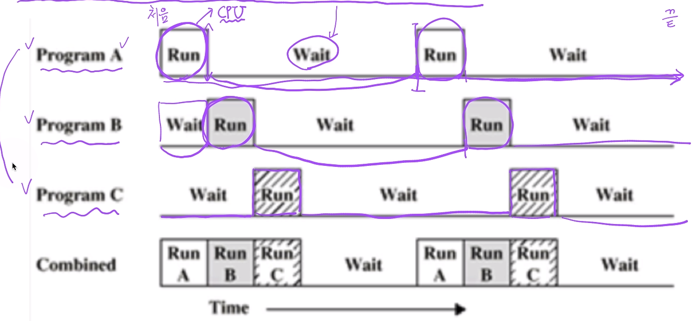
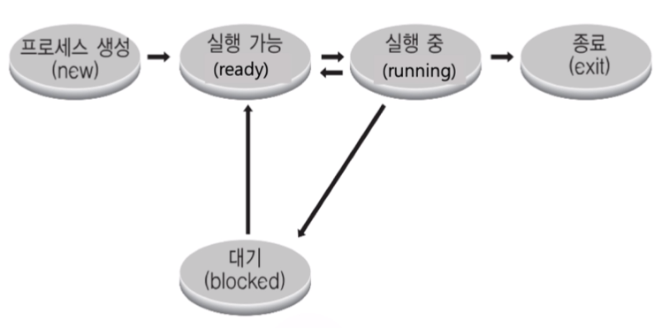
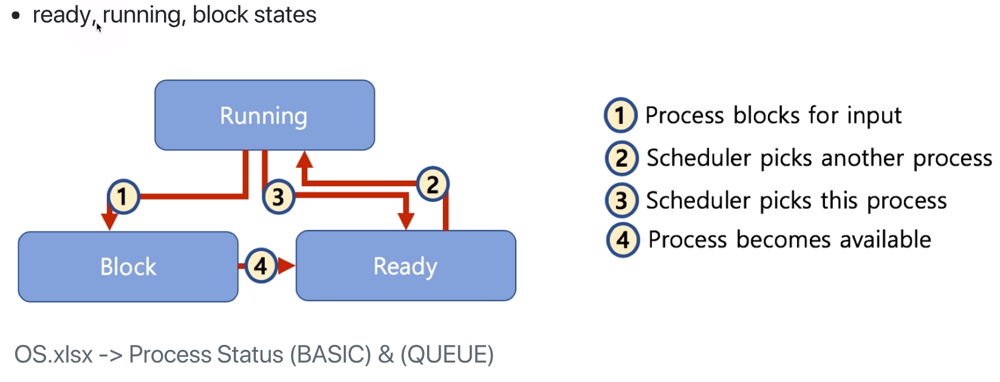

[toc]

# 프로세스와 스케쥴러의 이해 - 프로세스 상태와 스케쥴러

## :heavy_check_mark: 멀티 프로그래밍과 Wait

- 멀티 프로그래밍: CPU 활용도를 극대화 하는 스케쥴링 알고리즘
- Wait: 간단히 저장 매체로부터 파일 읽기를 기다리는 시간으로 가정

## :heavy_check_mark: 프로세스 상태

- running state: 현재 CPU에서 실행 상태
- ready state: CPU에서 실행 가능 상태 (실행 대기 상태)
- block state: 특정 이벤트 발생 대기 상태 (ex) 프린팅 완료시 저장매체에서 이벤트 발생(프린트 완료!) 대기)

 

### 프로세스 상태 간 관계

