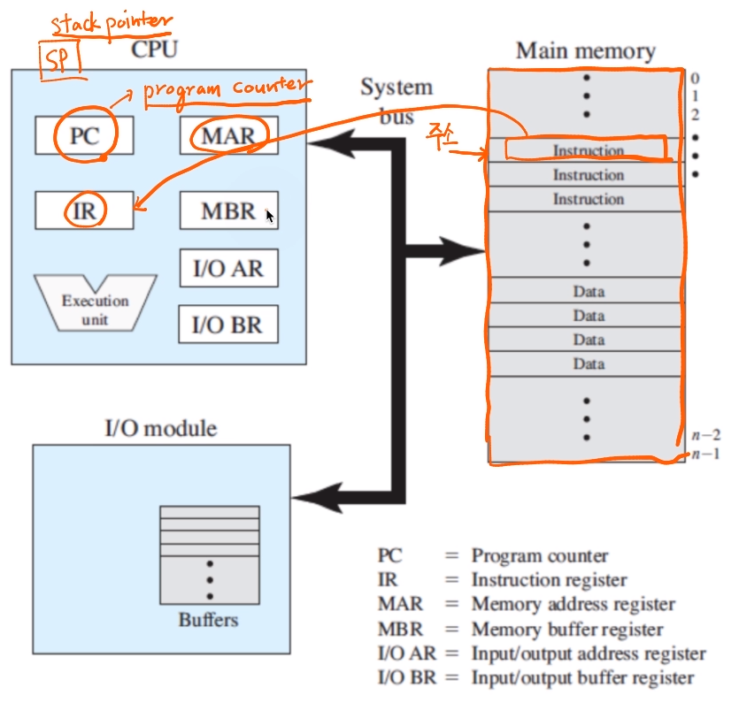
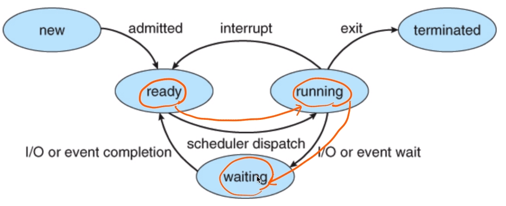
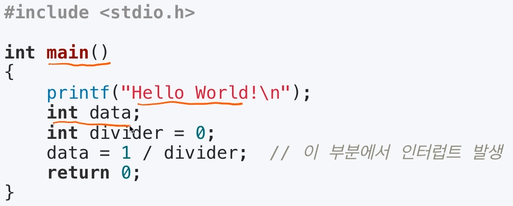
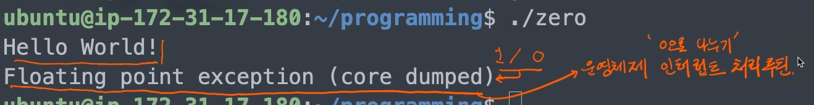
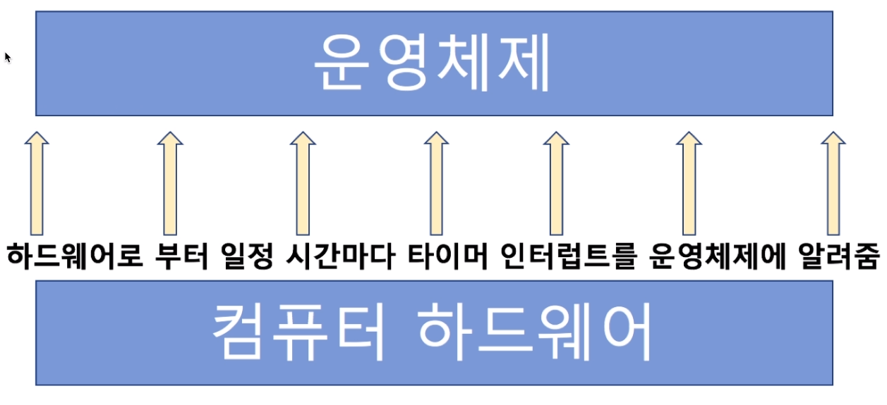

[toc]

# 프로세스와 스케쥴러 이해 - 인터럽트란?

## :heavy_check_mark: 인터럽트란?

- 인터럽트는 일종의 이벤트로 불림 -> 이벤트에 맞게 운영체제가 처리

- CPU가 프로그램을 실행하고 있을 때, 입출력 하드웨어 등의 장치나 또는 예외상황이 발생(**이벤트 발생**)하여 **처리 (kernel)**가 필요할 경우에 **CPU에 알려서 처리하는 기술**

  > 어느 한순간 CPU가 실행하는 명령은 하나! 다른 장치와 커뮤니케이션은 어떻게?
  >
  > #### 현 컴퓨터의 CPU 기본 구조
  >
  > 

## :heavy_check_mark:  인터럽트가 필요한 이유

#### 1. 선점형 스케쥴러 구현

- 프로세스가 running중에 스케쥴러가 이를 중단시키고, 다른 프로세스로 교체하기 위해, 현재 프로세스 실행을 중단시킴

  > 그러려면! 스케쥴러 코드가 실행이 돼서, 현 프로세스 실행을 중지시켜야함!

#### 2. IO Device와의 커뮤니케이션

- 저장매체에서 데이터 처리 완료시, 프로세스를 꺠워야함 (block state -> ready state)

#### 3. 예외상황 핸들링

- CPU가 프로그램을 실행하고 있을 때, **입출력 하드웨어 등의 장치나 또는 예외상황이 발생**할 경우, **CPU가 해당 처리를 할 수 있도록 CPU에 알려줘야함**

## :heavy_check_mark:  인터럽트 처리 예

- CPU가 프로그램을 실행하고 있을 때
  - 입출력 하드웨어 등의 장치 이슈 발생
    - **파일 처리가 끝났다는 것을 운영체제에 알려주기**
    - 운영체제는 해당 프로세스를 **block state에서 실행 대기(ready) 상태로 프로세스 상태 변경**
  - 또는 예외 상황이 발생
    - 0으로 나누는 계산(오류)이 발생해서, **예외 발생을 운영체제에 알려주기**
    - 운영체제가 해당 프로세스 **실행 중지/에러 표시**

## :heavy_check_mark: 주요 인터럽트 (Interrupt)

### 1. 계산하는 코드에서 0으로 나누는 코드 실행시 (Divide-by-Zero Interrupt)

 

### 2. 타이머 인터럽트

- 선점형 스케쥴러를 위해 필요

  >어느시점에 강제로 프로세스를 종료하려면 필요

  

### 3. 입출력(IO) 인터럽트

- 프린터, 키보드, 마우스, 저장매체(SSD등)

## :heavy_check_mark: 인터럽트 종류

### 내부 인터럽트 (소프트웨어 인터럽트)

- 주로 프로그램 내부에서 잘못된 명령(예외상황) 또는 잘못된 데이터 사용시 발생
  - 0으로 나눴을때
  - 사용자 모드에서 허용되지 않은 명령 또는 공간 접근시 (c언어 포인터)
  - 계산 결과가 Overflow/Underflow 날 때

 

### 외부 인터럽트 (하드웨어 인터럽트)

- 주로 하드웨어에서 발생되는 이벤트 (프로그램 외부)
  - 전원 이상
  - 기계 문제
  - 키보드등 IO 관련 이벤트
  - Timer 이벤트

