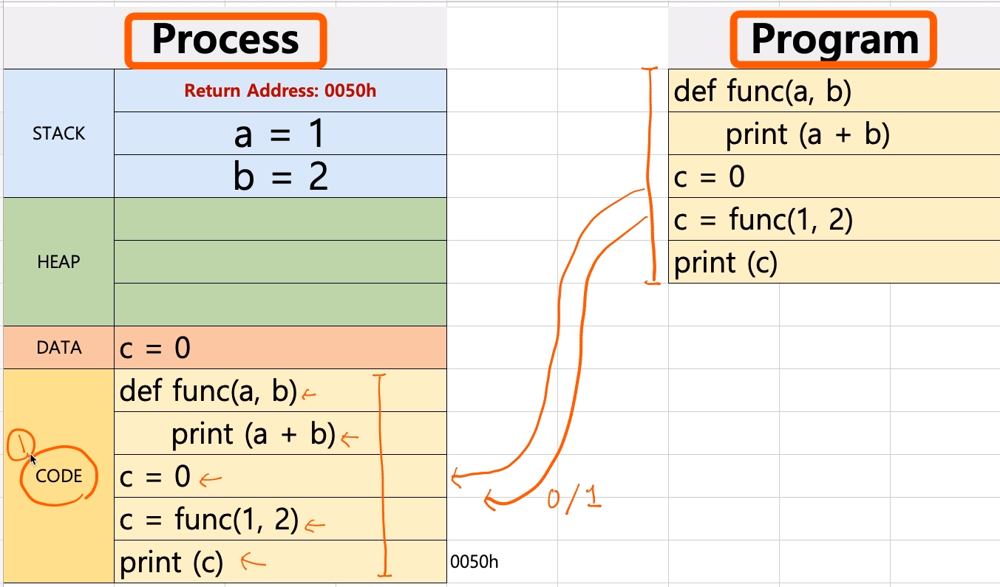
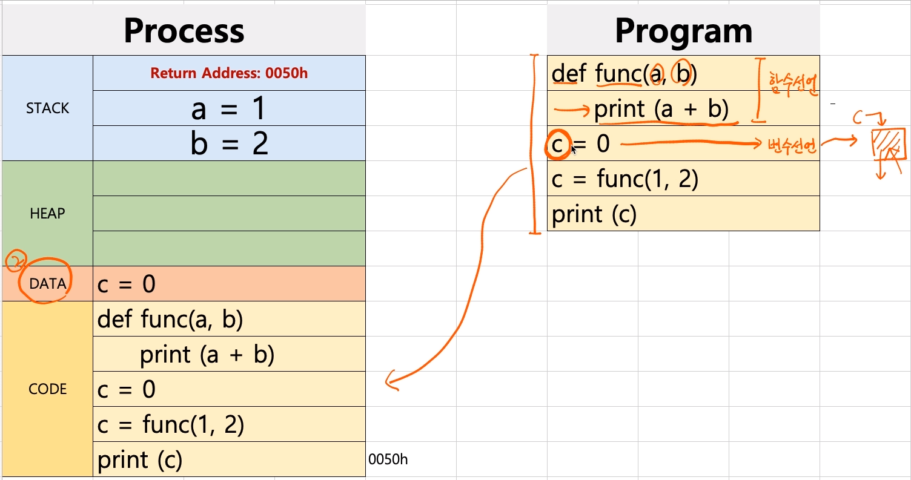
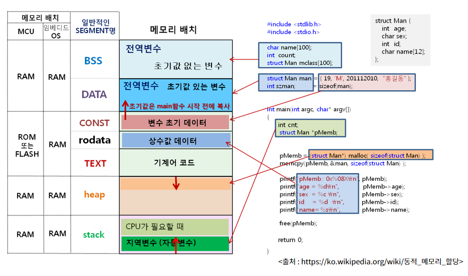
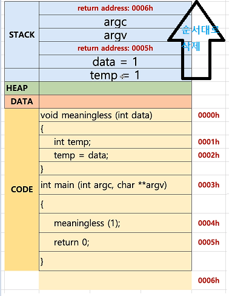

[toc]

# 프로세스와 스케쥴러 이해 

# - 프로세스와 컨텍스트 스위칭, 프로세스 구조

## :heavy_check_mark: 프로세스 구조 deep dive

### CODE 영역

- 컴파일된 소스코드가 저장됨



<br>

### DATA 영역

- 선언된 변수 영역 : `c=0`



<br>



### STACK 영역

- 함수 안에 변수 지정 -> 함수가 끝나면 사라짐 -> **지역변수, 매개변수**
- 컴파일 타임에 크기 결정


<br>

### HEAP 영역

- 사용자의 동적 할당
- 런타임에 크기 결정

<br>


### STACK - C언어 예제

```c
void meaningless (int data)
{
    int temp;
    temp = data;
}
int main (int argc, char **argv)
{
    meaningless(1);
    return 0;
}
```




<hr>

## :heavy_check_mark: 


<hr>

## :heavy_check_mark: 


<hr>

## :heavy_check_mark: 


<hr>


## :heavy_check_mark: 