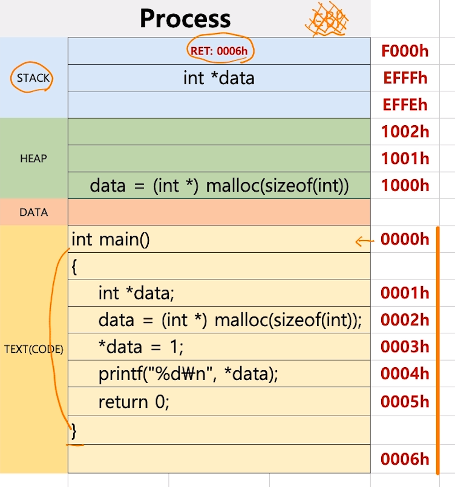
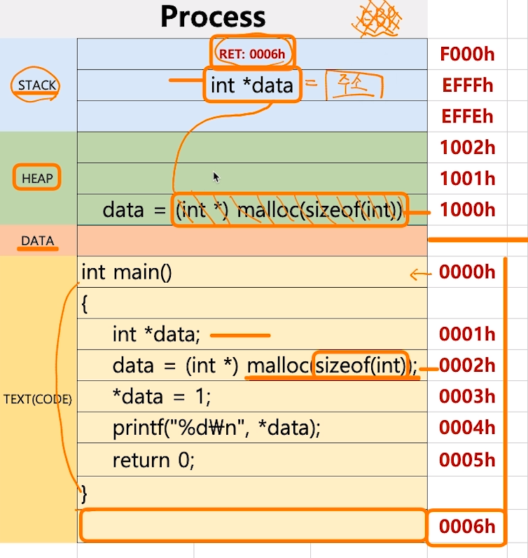
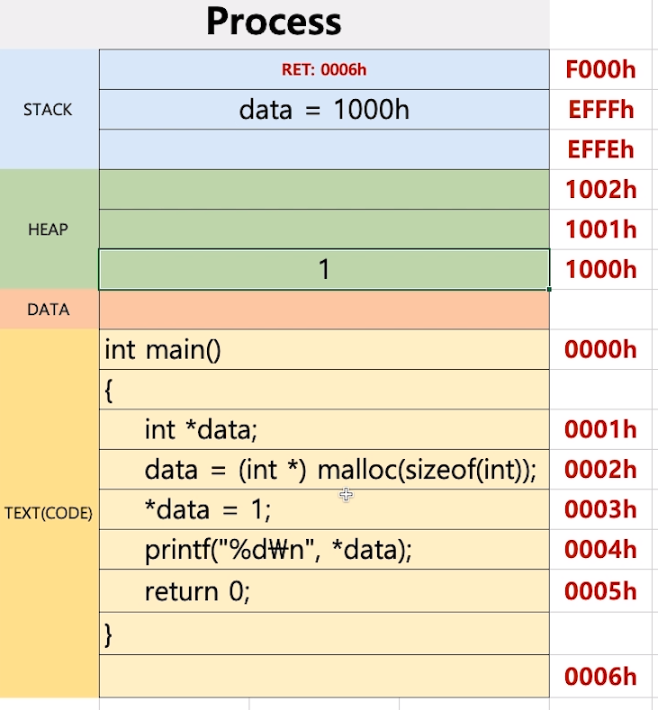

[toc]

# 프로세스와 스케쥴러 이해 

# - 프로세스 구조와 Heap

## :heavy_check_mark: 동적으로 생성되는 메모리 HEAP

### `malloc` 예제 코드

```c
#include <stdio.h>
#include <stdlib.h>

int main()
{
    int *data; 
    data = (int *) malloc(sizeof(int)); // 동적 메모리 접근 주소 -> HEAP 공간에 생성되는
    *data = 1; // 해당 주소에 1 넣어  
    printf("%d\n", *data);
    
    return 0;
}
```



- HEAP에 32bit의 공간이 생성되고, STACK에 있는 `int *data`에 HEAP 주소값이 들어감

  

- `*data = 1` > *data가 가리키는 HEAP 주소 공간에 1 넣어

  

  


