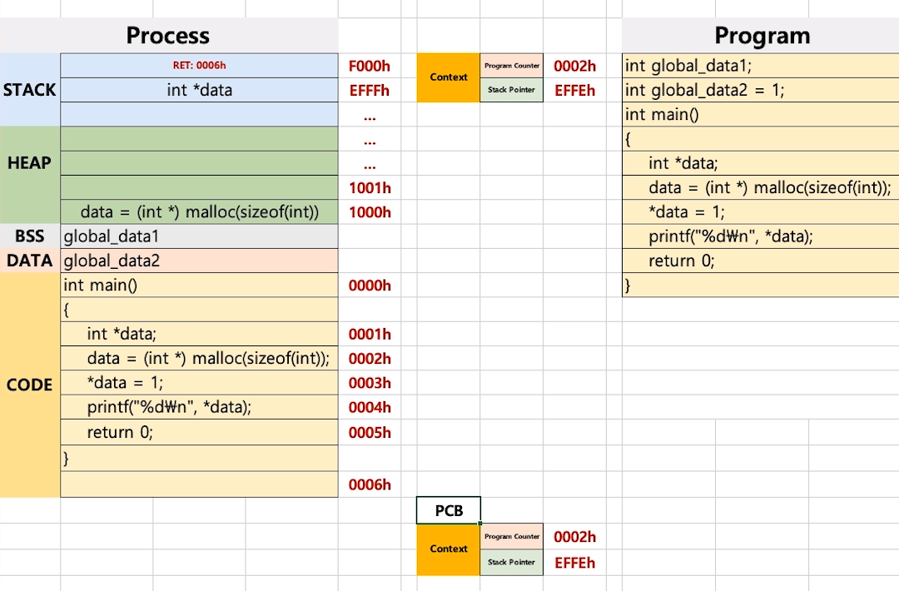
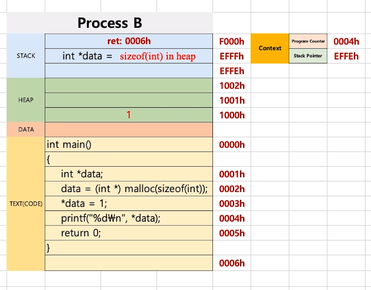
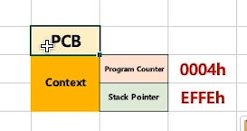

[toc]

# 프로세스와 스케쥴러 이해 

# - 컨텍스트 스위칭 원리

## :heavy_check_mark: 프로세스와 컨텍스트 스위칭

> PC(Program Counter), SP(Stack Pointer)에 주목 


### PCB (Process Control Block)

> Process Context Block 이라고도 함

- PC, SP 값을 **각각의 프로세스마다 관리**하는 PCB라는 저장공간

- CPU가 프로세스를 스위칭 하기 전에 PCB에 **현재 프로세스 정보를 저장**
  - Process ID
  - Register 값 (PC, SP)
  - Scheduling Info (Process State)
  - Memory Info (memory size limit)
  - ,,,
- 프로세스가 실행중인 상태를 **캡쳐/구조화**해서 저장


<hr>
## :heavy_check_mark: 코드 예제

프로그램이 2개가 있다고 가정

**program A**

```c
int global data1;
int global data12 = 1;

int main()
{
    int *data;
    data = (int *) malloc(sizeof(int));
    *data = 1;
    printf("%d\n", *data);
    return 0;
}
```

**program B **

```c
int main()
{
    int *data;
    data = (int *) malloc(sizeof(int));
    *data = 1;
    printf("%d\n", *data);
    return 0;
}
```



- program A을 실행하다가 
- 만약 0002h 라인에서 program B로 스위칭을 한다면
- **PCB** 라는 레지스터에 현재 Context 값을 저장하고 새로운 program을 실행

- program B 실행

  

  

  0004h라인에서 다시 B -> A 로 프로세스를 스위칭 한다면

  1- B의 PCB의 값을 저장

  2- CPU가 A의 PCB값을 현재 CPU Context값으로 변경 

- 다시 A의 0002h부터 시작


<hr>
## :heavy_check_mark: 정리

- 프로세스 구조
  - STACK
  - HEAP
  - DATA(BSS, DATA)
  - TEXT(CODE)
- PCB
  - 프로세스 상태정보 - PC, SP, 메모리, 스케쥴링 정보 등


