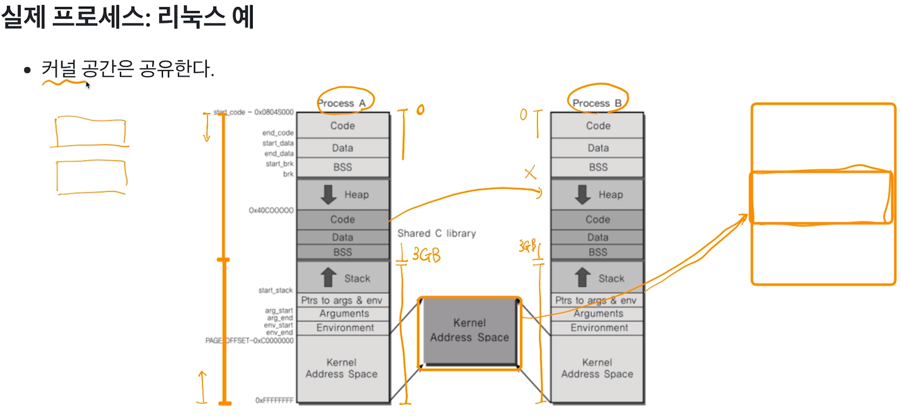

[toc]

# 프로세스와 스케쥴러 이해 

# - IPC 프로세스간 커뮤니케이션 (InterProcess Communication)

## :heavy_check_mark: 프로세스간 커뮤니케이션

- 프로세스는 다른 프로세스의 공간을 접근할 수 없다. -> 원칙적으로 **금지**
  - 프로세스들이 서로 공간을 쉽게 접근한다면, 프로세스 데이터/코드가 바뀔 수 있으니 위험!
- 프로세스간 공간은 완전히 분리되어있다.

### 프로세스간 통신 필요?

- 성능을 높이기 위해 여러 프로세스를 만들어서 동시 실행

- 이 때 프로세스 간 상태 확인 및 데이터 송수신이 필요함 

- ex) fork() 시스템콜

  - fork() 함수로 프로세스 자신을 복사해서 새로운 프로세스로 만들 수 있음

    - 부모 프로세스, 자식 프로세스 

  - 프로세스를 fork() 해서, 여러 프로세스를 동시에 실행시킬 수 있음

    > CPU가 한 개일때만 생각하지만, 
    >
    > 최근에는 CPU안에 코어가 여러개가 되는 경우도 많고, 각 프로세스를 각 코어에 동시 실행 가능 (병렬처리)
    >
    > - 프로세스 동시 실행 예
    >
    >   1~1000까지 더하기
    >
    >   1. fork() 함수로 10개 프로세스 만들어서, 각각 1~1000, 1001~2000, ...  더하기
    >   2. 각각 더한 값을 모두 합하면, 더 빠르게 동작 가능
    >
    >   단, 이때 각 프로세스가 더한 값을 수집해야 하므로, **프로세스간 통신 필요**

## :heavy_check_mark: IPC (InterProcess Communication)

- 프로세스간 통신 방법을 제공함

### 1. file 사용

간단히 다른 프로세스에 전달할 내용을 파일에 쓰고, 다른 프로세스가 해당 파일을 읽으면 됨

- BUT! file을 사용하면, 실시간으로 직접 원하는 프로세스에 데이터 전달이 어려움
  - 해당 프로세스가 파일을 읽어야하는데, 계속 실시간으로 읽기는 힘듦

### 2. Message Queue

### 3. Shared Memory

### 4. Pipe

### 5. Signal

### 6. Semaphore

### 7. Socket

...

> 2번부터는 모두 **커널 공간**을 사용하는 것임 !!
>
> 

## :heavy_check_mark: 정리

- 여러 프로세스 동시 실행을 통한 성능 개선, 복잡한 프로그램을 위해 프로세스간 통신 필요
- 프로세스간 공간이 완전 분리
- 프로세스간 통신을 위한 특별한 기법이 필요
  - IPC
- 대부분의 IPC 기법은 결국 커널 공간을 활용하는 것임
  - 이유: 커널 공간은 공유되기 때문!

