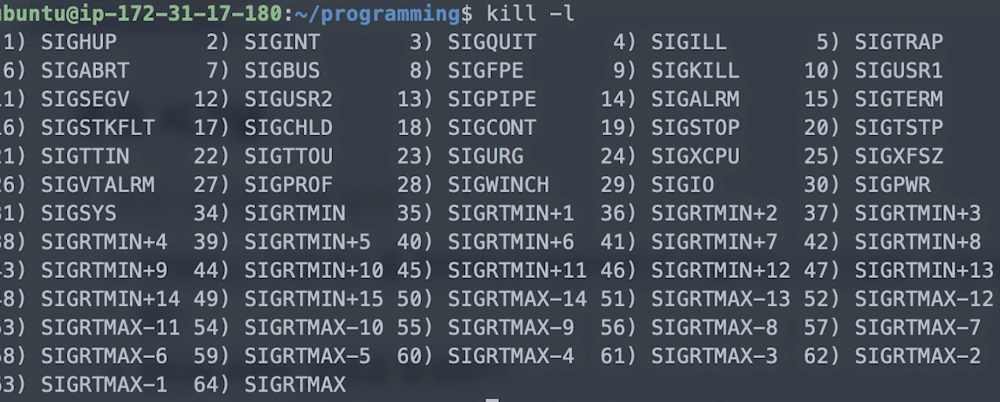
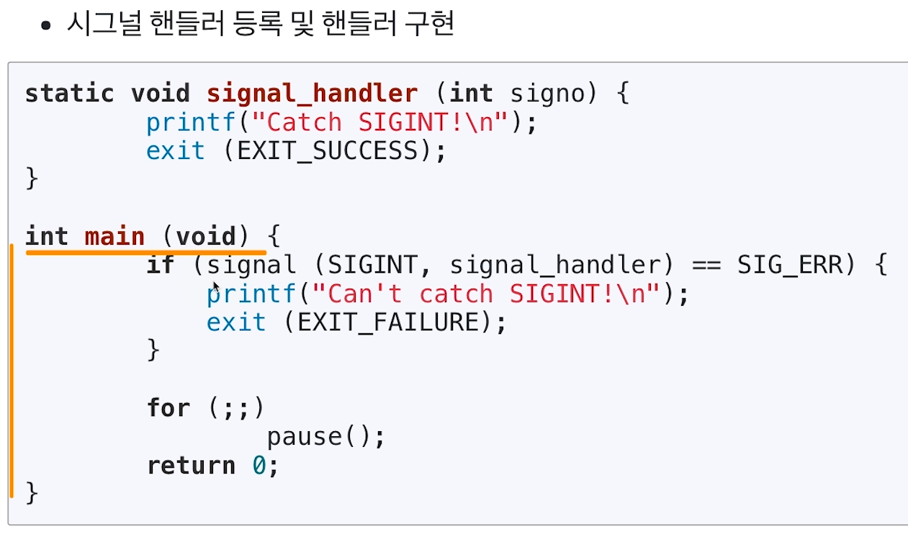
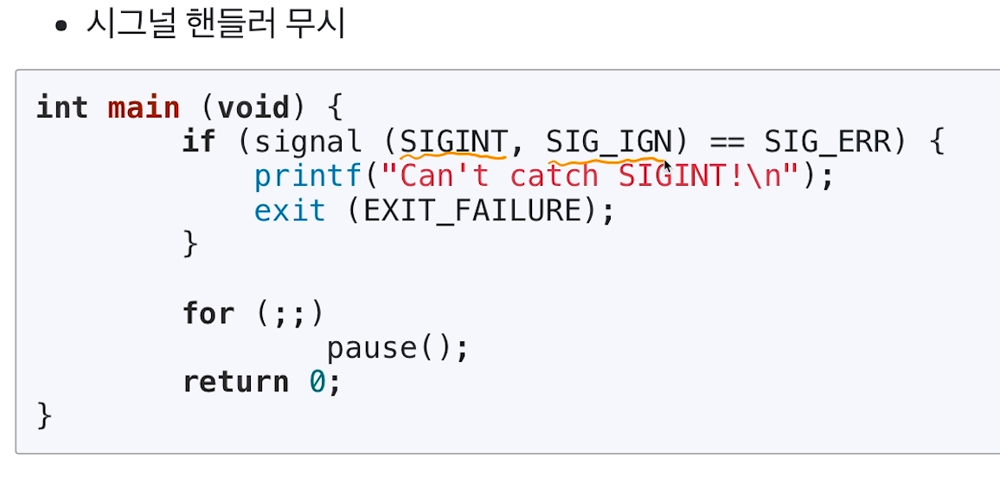
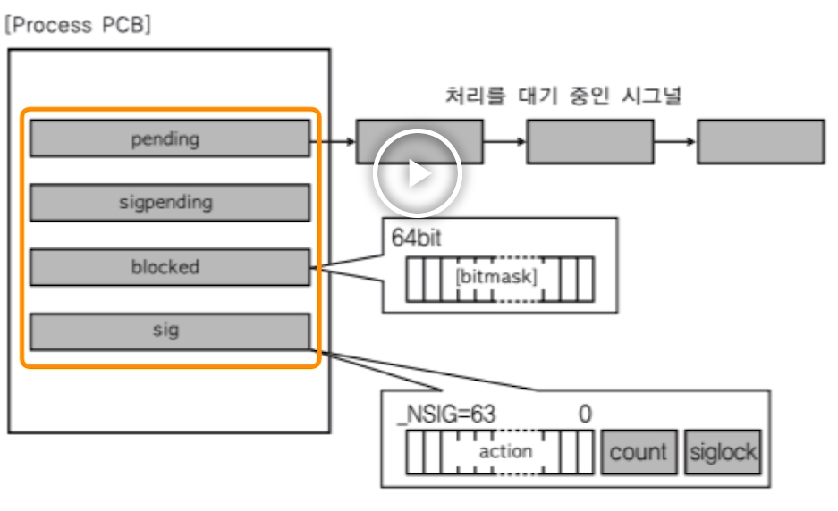
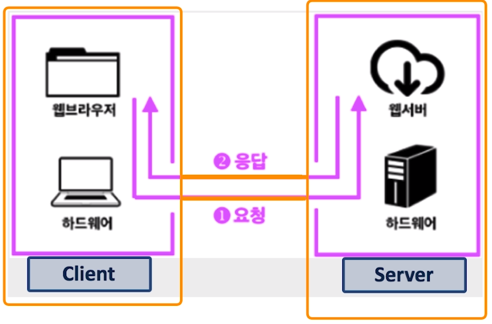
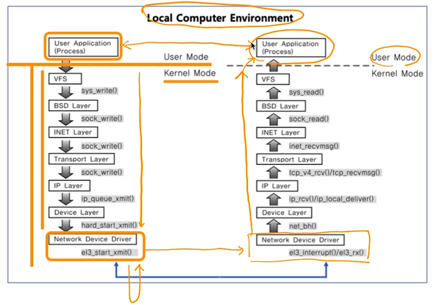

[toc]

# 프로세스와 스케쥴러 이해 

# - IPC (InterProcess Communication) 기법

## :heavy_check_mark: 다양한 IPC 기법

1. file 사용

2. Message Queue

3. Shared Memory

4. Pipe

5. Signal

6. Semaphore

7. Socket

...

> 2~7 프로세스가 커널 공간을 공유

## :heavy_check_mark: Signal, Socket

- IPC 기법이지만, 이외에도 많이 사용되는 두가지 기술

  > 간단하게만 짚고 넘어감

## :heavy_check_mark: 5. Signal (시그널) - 이벤트

- 유닉스에서 30년이상 사용된 전통적인 기법
- 커널 또는 프로세스에서 다른 프로세스에 어떤 이벤트가 발생되었는지 알려주는 기법
- 프로세스 관련 코드에 관련 시그널 핸들러를 등록해서, 해당 시그널 처리 실행
  - 시그널 무시
  - 시그널 블록 (블록을 푸는 순간, 프로세스에 해당 시그널 전달)
  - 등록된 시그널 핸들러로 특정 동작 수행
  - 등록된 시그널 핸들러가 없다면, 커널에서 기본 동작 수행

### 주요 시그널

> 주요 시그널: 기본 동작
>
> 시그널 종류: kill -l
>
> 

- SIGKILL: 프로세스를 죽여라 (슈퍼 관리자가 사용하는 시그널로, 프로세스는 어떤 경우든 죽도록 되어있음)
- SIGALARM: 알람 발생
- SIGSTP: 프로세스를 멈춰라 (Ctrl + z)
- SIGCONT: 멈춰진 프로세스를 실행해라
- SIGINT: 프로세스에 인터럽트를 보내서 프로세스를 죽여라 (Ctrl + c)
- SIGSEGV: 프로세스가 다른 메모리 영역을 침범했다
- SIGUSR1: 기본동작 X -> 특별동작 
- SIGUSR2: 기본동작 X -> 특별동작 

### 예제 코드

> SIGINT 시그널을 받으면, signal_habdler() 함수로 실행 -> 원래기능 X

> SIG_IGN : 무시

## :heavy_check_mark: 시그널과 프로세스

> PCB에 해당 프로세스가 블록 또는 처리해야하는 시그널 관련 정보 관리

> 커널에서 사용자모드로 전환시 시그널을 처리함
>
> -> PCB의 signal을 확인해 처리 커널함수 처리 or 사용자 모드로 전환함과 동시에 특정동작 수행

## :heavy_check_mark: Socket (소켓)

- 소켓은 네트워크 통신을 위한 기술
- 기본적으로는 클라이언트와 서버 등 두 개의 다른 컴퓨터 간의 네트워크 기반 통신을 위한 기술

## :heavy_check_mark: 소켓과 IPC

- 소켓을 하나의 컴퓨터 안에서, 두 개의 프로세스간의 통신 기법으로 사용 가능 

## :heavy_check_mark: 정리

- 다양한 IPC 기법을 활용해, 프로세스간 통신이 가능하다.
- IPC 기법 외에도 사용할 수 있는 두가지 기술 개념
  - 시그널 (signal)
  - 소켓 (socket)

