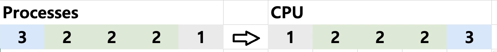
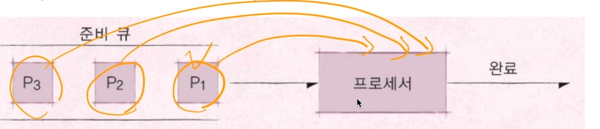
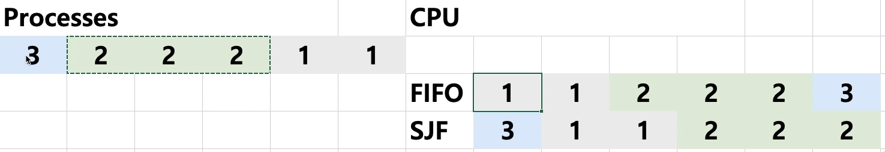
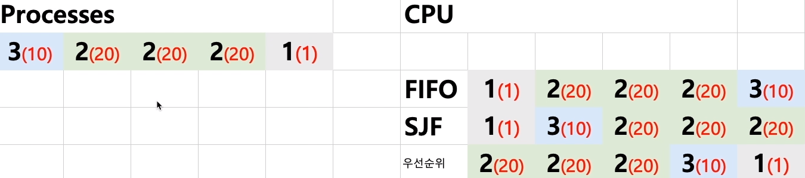
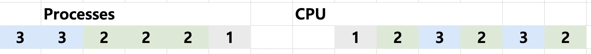
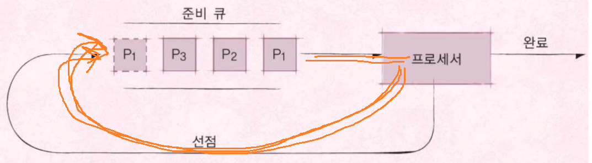

[toc]

# 프로세스와 스케쥴러의 이해 - 01. 스케쥴링 알고리즘

## :heavy_check_mark: 프로세스(process)란?

- **실행 중인 프로그램**
  - 프로세스: 메모리에 올려져서, 실행 중인 프로그램
  - 코드 이미지(바이너리): 실행 파일, 예: ELF format

- 프로세스 = 작업, task, job 이라는 용어와 혼용

- 응용 프로그램 != 프로세스

  - 응용 프로그램은 여러 개의 프로세스로 이뤄질 수 있다

- 하나의 응용 프로그램은 여러 개의 프로세스(프로그램)가 상호 작용을 하면서 실행될 수도 있다.

  > 간단한 C/C++ 프로그램을 만든다면
  >
  > 하나의 프로세스 여러 프로그램을 만들어서, 서로 통신하면서 프로그램을 작성할 수도 있다. (IPC 기법)

## :heavy_check_mark: 스케쥴러와 프로세스

- 스케쥴러: 프로세스 실행을 관리

## :heavy_check_mark: 스케쥴링 알고리즘

> 어느 순서대로 프로세스를 실행 시킬까?

### 목표

- 시분할 시스템의 목표: 프로세스 응답 시간을 가능한 짧게
- 멀티 프로그래밍의 목표: CPU 활용도를 최대로 높혀서, 프로세스를 빨리 실행

> 프로세스가 저장매체를 읽는다든지, 프린팅을 한다든지 하는 작업없이, 
>
> 쭉 CPU를 처음부터 끝까지 사용한다는 가정으로 진행. 
>
> CPU만 계속 사용한다는 프로그램으로 가정

### 1. FIFO 스케쥴러

- 가장 간단한 스케쥴러 (배치 처리 시스템)

- 먼저 들어온 프로세스 순서대로 실행

- FCFS (First Com First Served)

  

 

### 2. 최단 작업 우선 (SJF) 스케쥴러

- SJF (Shortest Job First) 스케쥴러
- 가장 프로세스 실행 시간이 짧은 프로세스부터 먼저 실행시킨다.

 

### 3. 우선순위 기반 스케쥴러

- Priority-Based 스케쥴러
- 정적 우선순위
  - 프로세스마다 우선순위를 미리 지정
- 동적 우선순위
  - 스케쥴러가 상황에 따라 우선순위를 동적으로 변경

 

### 4. Round Robin 스케쥴러

- 시분할 시스템 기반
- 일정 시간내에 프로세스가 끝나지 않으면 다시 큐로 

## :heavy_check_mark: 잠깐!

### RealTime OS (RTOS)

- 응용 프로그램 실시간 성능 보장을 목표로하는 OS
- 정확하게 프로그램 시작, 완료 시간을 보장 
- 프로세스 실행시간 시간이 굉장히 민감한 경우 사용되는 OS
- Hardware RTOS, Software RTOS

### General Purpose OS (GPOS)

- 프로세스 실행시간에 민감하지 않고, 일반적인 목적으로 사용되는 OS
- Windows, Linux 등

