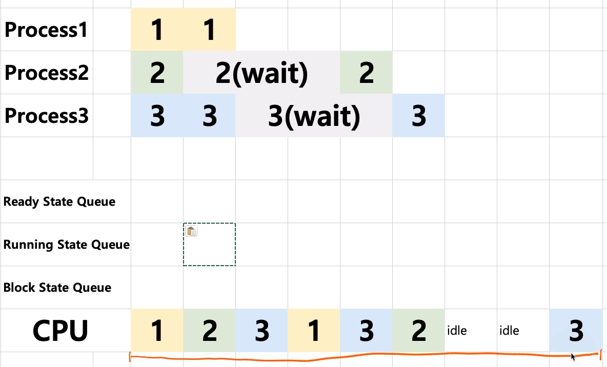

[toc]

# 프로세스와 스케쥴러의 이해 - 프로세스 상태와 스케쥴링 알고리즘

## :heavy_check_mark: 스케쥴링 알고리즘

ex)  3개의 State Queue 활용

- Ready State Queue
- Running State Queue
- Block State Queue

3개의 큐를 이용해 CPU가 프로세스 선택

> CPU가 아무 작업도 X: CPU idle 상태