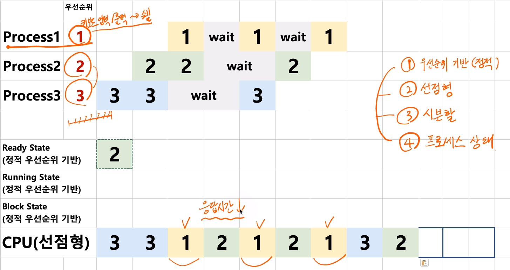

[toc]

# 스케쥴링 알고리즘 - 스케쥴링 알고리즘 조합

## :heavy_check_mark: 스케쥴러 구분 (정책, policy)

- FIFO(FCFS), SJF, Priority-based는 어떤 프로세스를 먼저 실행시킬지에 대한 알고리즘 (비선점형 스케쥴링에 가까움)
- RoundRobin은 시분할 시스템을 위한 기본 알고리즘 (선점형 스케쥴러 방식)

## :heavy_check_mark:  스케쥴링 조합 예제

> - 시분할 (2초단위)
> - 프로세스 상태 고려
> - 정적 우선순위 기반
> - 선점형 스케쥴링

## :heavy_check_mark:  가볍게..

렉? >  마우스/ 키보드 반응이 느린 경우?

> 스케쥴러가 해결해야하는 이슈!
>
> 다양하고 복잡한 스케쥴링 알고리즘 필요!

- 리눅스 스케쥴러
  - O(1), CFS와 같이 다양한 방식으로 변경 시도 중
    - 인터렉티브, IO, CPU 중심 프로세스로 미리 구분할 수 있다면 보다 개선된 스케쥴링이 가능함

