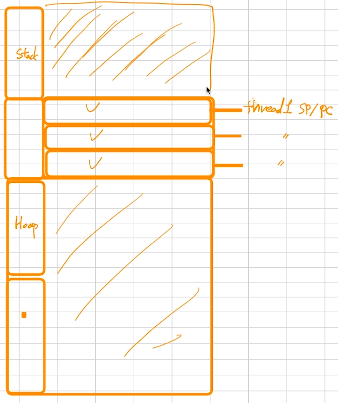
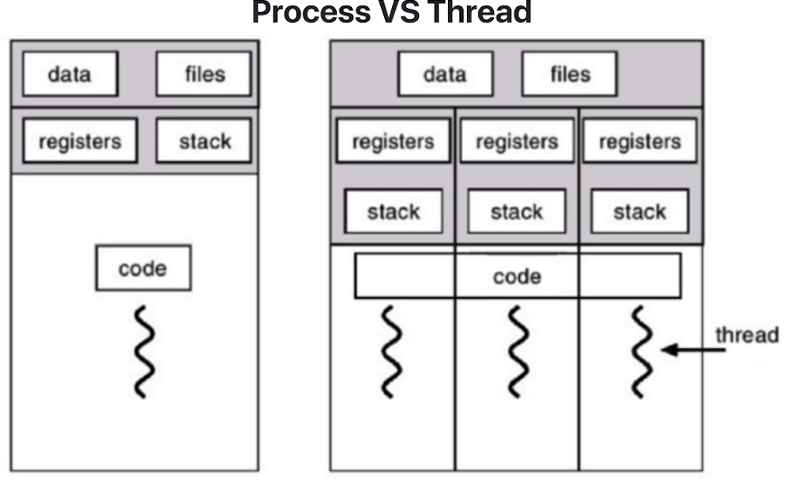
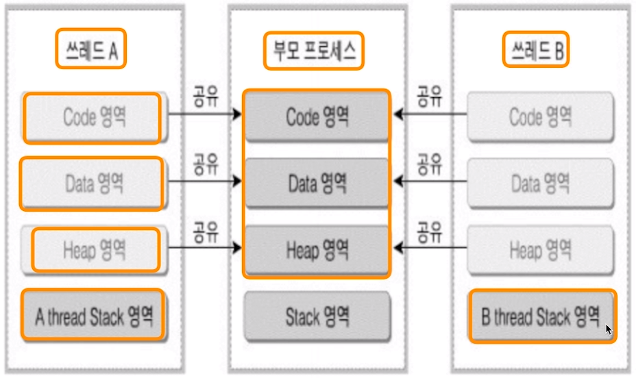
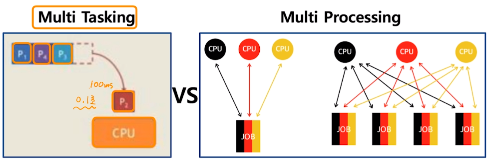
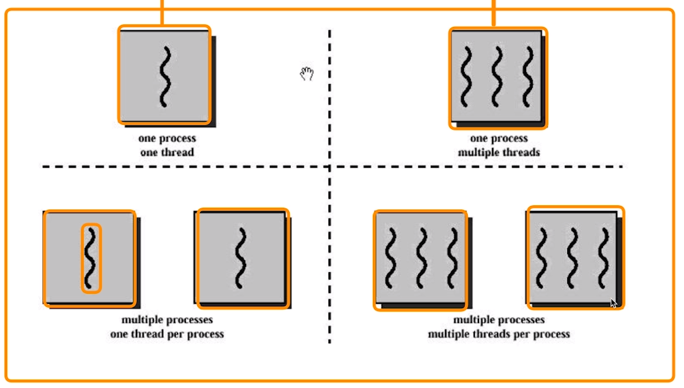

[toc]

# Thread (스레드)

## :heavy_check_mark: 스레드 개념

- Light Weight Process 라고도 함

- 프로세스 -> IPC

  

  - 프로세스 간에는 각 프로세스의 데이터 접근이 불가

- 스레드 -> IPC X

  

  - 하나의 프로세스에 여러개의 스레드 생성 가능
  - 스레드들은 동시에 실행 가능
  - 프로세스 안에 있으므로, 프로세스의 데이터를 모두 접근 가능

## :heavy_check_mark: Thread는 각기 실행이 가능한 stack 존재

- stack과 heap사이의 공간에 thread 영역이 있음

  

  

### Process VS Thread

## :heavy_check_mark: Multi Trhead (멀티 스레드)

- 소프트웨어 병행 작업 처리를 위해 멀티 스레드를 사용함

## :heavy_check_mark: 멀티 프로세싱과 Thread

### 멀티 태스킹(하나의 CPU)과 멀티 프로세싱(여러개의 CPU - 병렬)

> 멀티 프로세싱의 JOB 을 어떻게 나눔?
>
> - Thread를 여러개 만들면 가능!
> - 최근 CPU는 멀티 코어를 가지므로, Thread를 여러 개 만들어, 멀티 코어 활용도를 높임!

### 활용 종류

- 1 process, 1 thread
- 1 process, multiple threads
- multiple process, 1 thread per process
- multiple processes, multiple threads per process

