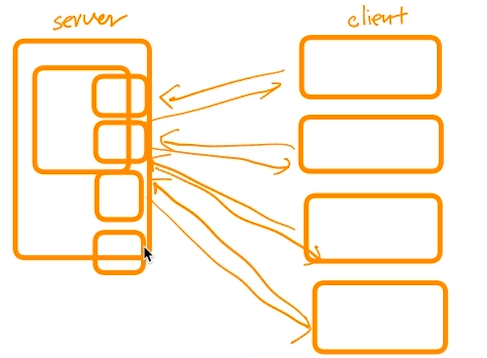
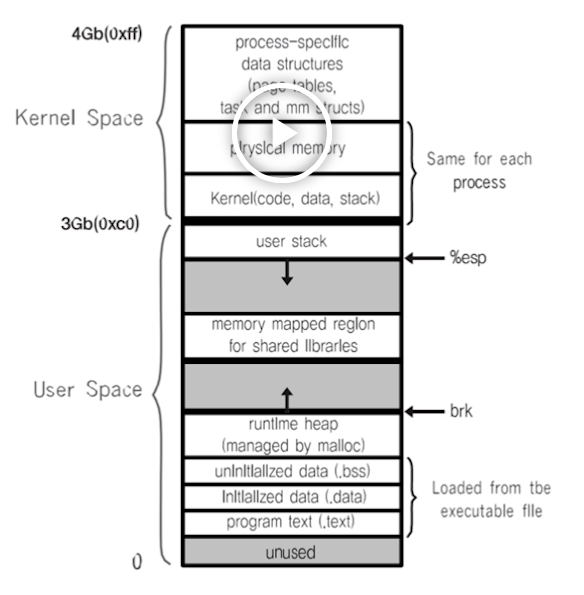
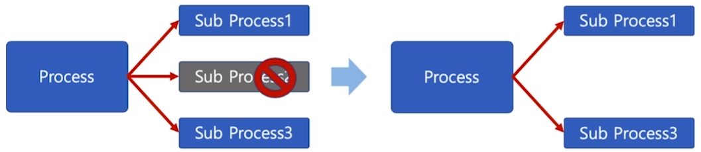
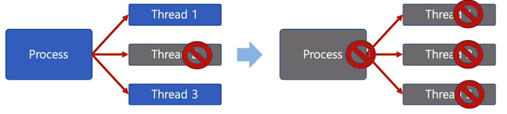

[toc]

# Thread (스레드) - 장단점

## :heavy_check_mark: 장점

### 1. 사용자에 대한 응답성 향상

### 2. 자원 공유 효율

- IPC 기법과 같이 프로세스간 자원 공유를 위해 번거로운 작업이 필요없음
- 프로세스 안에 있으므로, 프로세시의 데이터를 모두 접근 가능

### 3. 작업이 분리되어 코드가 간결

- 작성하기 나름 ㅎㅎ

## :heavy_check_mark: 단점

### 1. 스레드 중 한 스레드만 문제가 있어도, 전체 프로세스가 영향을 받음

#### 멀티 프로세스

#### 멀티 스레드

### 2. 성능 저하

- 스레드를 많이 생성하면, Context Switching이 많이 일어나, 성능 저하
- 예) 리눅스 OS에서는 Thread를 Process와 같이 다룸
  - 스레드를 많이 생성하면, 모든 스레드를 스케쥴링해야 하므로, Context Switching이 빈번할 수 밖에 없음

## :heavy_check_mark: Thread Process

| Thread             | Process                   |
| ------------------ | ------------------------- |
| 프로세스의 서브 셋 | 독립적                    |
| 프로세스 자원 공유 | 각각 독립적인 자원을 가짐 |
| 주소영역 공유      | 자신만의 주소영역을 가짐  |
| IPC기법 필요X      | IPC 기법으로 통신해야함   |

## :heavy_check_mark: PThread

- POSIX 스레드(POSIX Threads)
  - Thread 관련 표준 API

## :heavy_check_mark: 정리

- Thread?
  - 프로세스와 달리 스레드간 자원 공유
- 장점
  - CPU활용도 높이고
  - 성능 개선 가능
  - 응답성 향상
  - 자원 공유 효율 (IPC안써도됨)
- 단점
  - 하나의 스레드 문제가 프로세스 전반에 영향
  - 여러 스레드 생성시 성능 저하 가능

