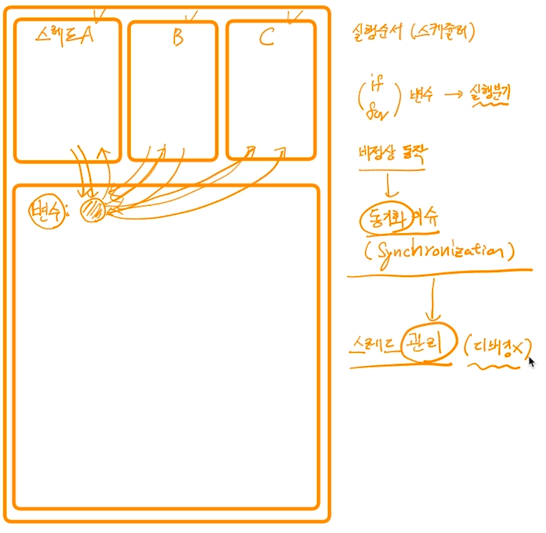
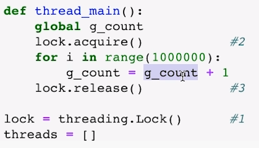

[toc]

# Thread (스레드) - 동기화 문제

## :heavy_check_mark: 동기화 (Synchronization) 이슈 

> 스레드의 실행 순서가 잘못되어 여러스레드에서 변수를 동시에 읽고 쓰다 동기화 이슈가 생길수도

> python 예제
>
> `lock.acquire()`, `lock.release()` 와 같은 함수 사용
>
> 

## :heavy_check_mark: 

## :heavy_check_mark: 

## :heavy_check_mark: 

