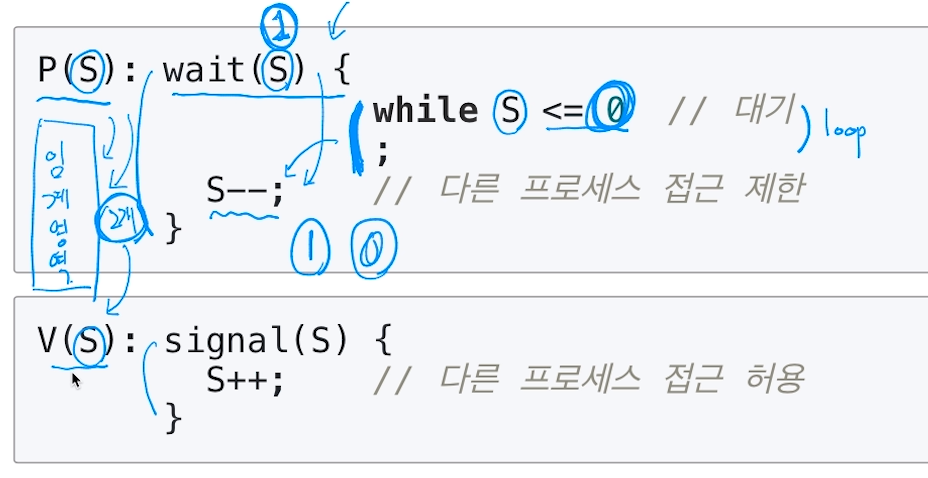
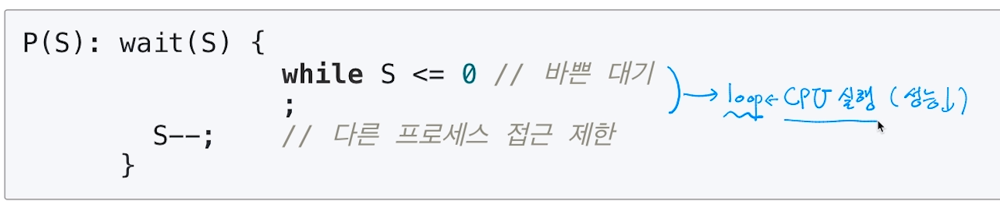
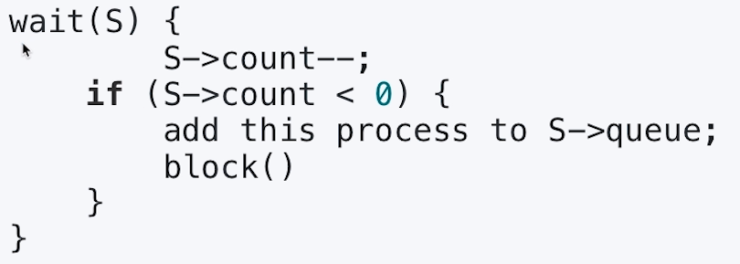

[toc]

# Thread (스레드) - 동기화와 세마포어

## :heavy_check_mark: Mutex와 세마포어(Semaphore)

- Critical Section(임계 구역)에 대한 접근을 막기 위해 LOCKING 메커니즘이 필요

### Mutex (binary semaphore)

> 임계구역에 하나의 스레드만 들어갈 수 있음


### semaphore

> 임계구역에 여러 스레드가 들어갈 수 있음
>
> counter를 두어서 동시에 리소스에 접근할 수 있는 허용 가능한 스레드 수 제어


<hr>

## :heavy_check_mark: 세마포어 코드 예제

P = `lock.acquire()`

V = `lock.release()`




<hr>

## :heavy_check_mark: 세마포어 - 바쁜 대기


- `wait()`은 S가 0이라면, 임계영역에 들어가기 위해, 반복문 수행

  - 바쁜 대기, busy waiting

  


<hr>

## :heavy_check_mark: 세마포어 - 대기 큐

> 운영체제 기술로 보완 - 대기 큐

#### 1. S가 음수일 경우, **바쁜대기** 대신 **대기큐**에 넣는다.




#### 2. `wakeup()` 함수를 통해 대기큐에 있는 프로세스 재실행

```
signal(S) {
		S -> count++;
	if (S -> Count <= 1) {
		remove a process P from S ->  queue;
		wakeup(P)
	}
}
```


<hr>

## :heavy_check_mark: 참고: 주요 세마포어 함수 (POSIX 세마포어)

- `sem_open()` 세마포어를 생성
- `sem_wait()`: 임계영역 접근 전, 세마포어를 잠그고, 세마포어가 잠겨있다면, 풀릴때까지 대기
- `sem_post()`: 공유 자원에 대한 접근이 끝났을 때 세마포어 잠금을 해제


