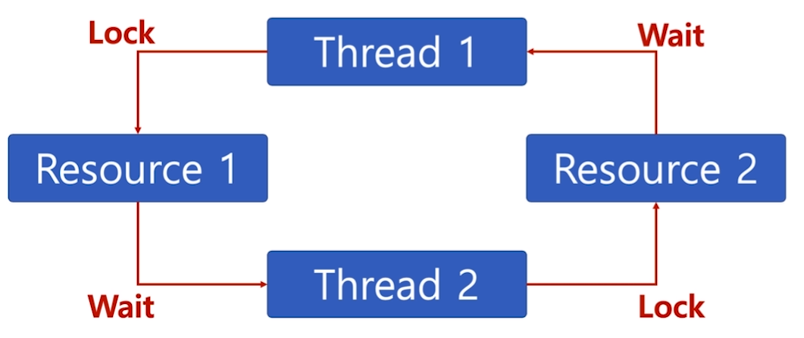

[toc]

# Thread (스레드) - 교착상태와 기아상태

## :heavy_check_mark: 교착상태(Deadlock)

- 무한 대기 상태
  - 두 개 이상의 작업이 서로 상대방의 작업이 끝나기만을 기다리고 있기 때문에, 다음 단계로 진행하지 못하는 상태

> 배치 처리 시스템에서는 일어나지 않는 문제
>
> 프로세스, 스레드 둘 다 이와 같은 상태가 일어날 수 있음

### 참고: 교착상태 발생 조건

- 다음 4가지 조건이 모두 성립될 때 교착상태 발생 가능성이 있다

1. 상호 배체 (Mutal exclustion): 프로세스들이 필요로하는 자원에 대해 배타적인 통제권을 요구
2. 점유대기 (Hold and wait): 프로세스가 할당된 자원을 가진 상태에서 다른 자원을 기다림
3. 비선점 (No preemption): 프로세스가 어떤 자원의 사용을 끝낼 때까지 그 자원을 뺏을 수 없다
4. 순환대기 (Circular wait): 각 프로세스는 순환적으로 다음 프로세스가 요구하는 자원을 가지고 있다.

## :heavy_check_mark: 기아상태(Starvation)

- 특정 프로세스의 우선순위가 낮아서 원하는 자원을 계속 할당받지 못하는 상태

## :heavy_check_mark: 교착상태와 기아상태

- 교착상태는 여러 프로세스가 동일 자원 점유를 요청할때 발생
- 기아상태는 여러 프로세스가 부족한 자원을 점유하기 위해 경쟁할 때, 특정 프로세스는 영원히 자원 할당이 안되는 경우를 주로 의미함

