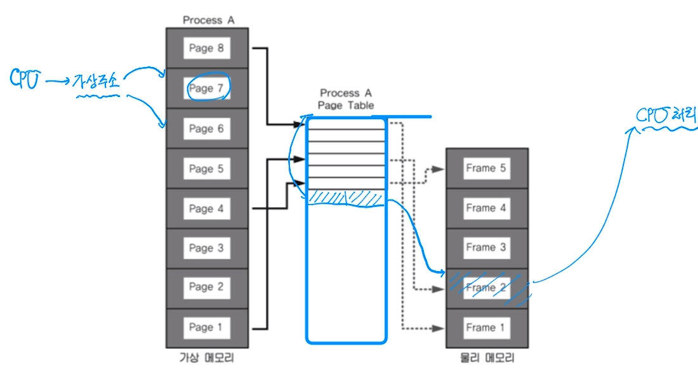
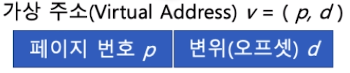
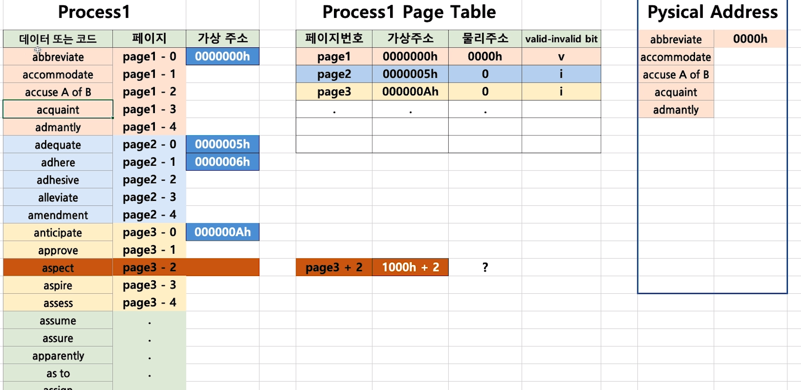
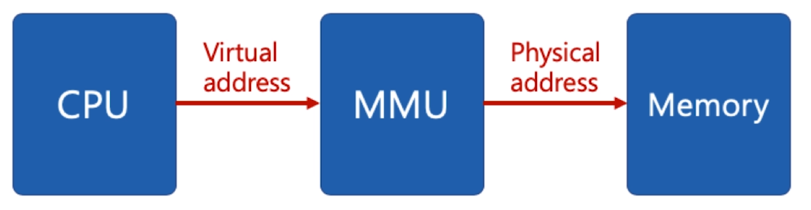

[toc]

# 가상 메모리 (Virtual Memory System) - 페이징 시스템

## :heavy_check_mark: 페이징 시스템 (paging system)

### 페이징 개념

- 크기가 동일한 페이지로 가상 주소 공간과 이에 매칭하는 물리 주소 공간을 관리
- 하드웨어 지원이 필요 
  - ex) Intel x86 시스템 (32bit)에서는 4KB, 2MB, 1GB 지원
- 리눅스에서는 4KB로 paging
- 페이지 번호를 기반으로 가상주소/물리주소 매핑 정보를 기록/사용

### 예시

- 프로세스(4GB)의 PCB에 Page Table 구조체를 가리키는 주소가 들어있음
- Page Table에는 가상주소와 물리주소간 매핑정보가 있음

## :heavy_check_mark: 페이징 시스템 구조

### page 또는 page frame

- 고정된 크기의 block (4KB)

### paging system

- 가상주소 `v = (p, d)`

  - p: 가상 메모리 페이지
  - d: p안에서 참조하는 위치 (변위): 해당 페이지 내의 위치

  

  > p + d = 실제 물리 메모리의 해당 데이터 위치

  

### 페이지 크기가 4KB 예시

- 가상 주소의 0비트에서 11비트가 **변위(d)**를 나타내고,
- 12비트 이상이 페이지 번호가 될 수 있음

## :heavy_check_mark: 페이지 테이블 (page table)

### page table

- 물리 주소에 있는 페이지 번호와 해당 페이지의 첫 물리 주소 정보를 매핑한 표
- 가상 주소 `v = (p, d)` 면
  - p: 페이지 번호
  - d: 페이지 처음부터 얼마 떨어진 위치인지

### paging system 동작

- 해당 프로세스에서 특정 가상 주소 엑세스를 하려면
  - **해당 프로세스의 page table에 ** 해당 가상 주소가 포함된 page 번호가 있는지 확인
    - PCB에 page table의 base주소 + 페이지 번호 -> page table에서 해당 page로 넘어감
    - page: 물리주소 + d = 물리 주소
  - page 번호가 있으면, 이 page가 매핑된 첫 물리주소를 알아내고 (p')
  - p' + d가 실제 물리주소가 됨

> valid-invalid bit > 물리주소에 해당 주소가 있는지 없는지 체크

## :heavy_check_mark: 페이징 시스템과 MMU(컴퓨터 구조)

- **CPU는 가상 주소 접근**시

  - **MMU 하드웨어 장치를 통해 물리 메모리 접근** -> 가상 주소를 물리 주소로 변환

  

  

- 프로세스 생성시, 페이지 테이블 정보 생성

  - **PCB 등에서 해당 페이지 테이블 접근 가능**하고, **관련 정보는 물리 메모리에 적재**
  - 프로세스 구동시, 해당 페이지 테이블 base주소가 **별도 레지스터에 저장 (CR3)**
  - CPU가 가상 주소 접근시, **MMU가 페이지 테이블 base주소를 접근(CR3 레지스터에서 확인)해서 물리주소를 가져옴**

