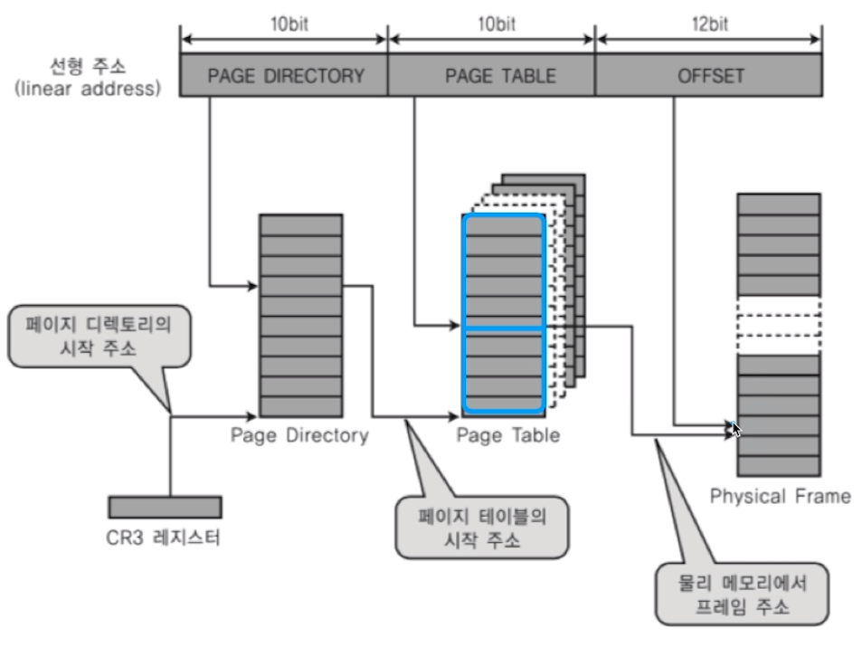
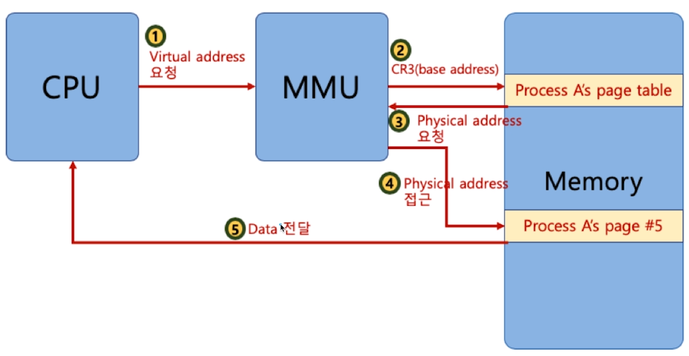
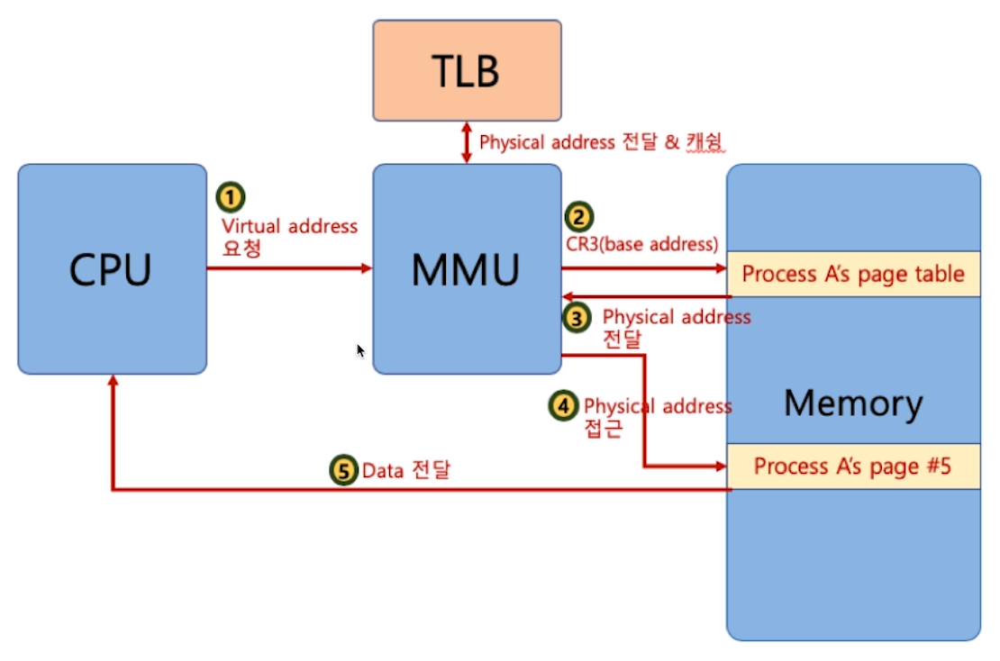
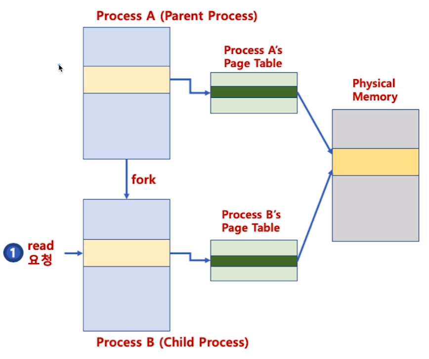
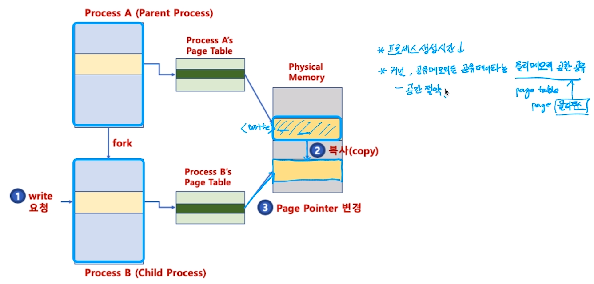

[toc]

# 다중 단계 페이징 시스템

- 32bit 시스템에서 4KB 페이지를 위한 페이징 시스템은
  - 하위 12bit는 오프셋
  - 상위 20bit가 페이징 번호이므로, 2의 20승(1048576) 개의 페이지 정보가 필요함
- 페이징 정보를 단계를 나누어 생성
  - 필요없는 페이지는 생성하지 않으면, 공간 절약 가능
- 페이지 번호를 나타내는 bit를 구분해서, 단계를 나눔 (리눅스는 3단계, 최근 4단계)

## :heavy_check_mark: MMU와 TLB(컴퓨터 구조)

- MMU가 물리주소를 확인하기 위해 메모리를 갔다와야함

> 2~4 번 과정에서 메모리 접근이 많아지면서 시간이 많이 걸림

### TLB (Translation Lookaside Buffer): 페이지 정보 캐쉬

- MMU에서 CR3 타기 전에 TLB 캐싱 검사
- 캐싱이 되어있으면 바로 4번 물리메모리 접근 (2번 생략하면서 메모리 접근 줄임)

## :heavy_check_mark: 페이징 시스템과 공유 메모리

- 프로세스간 동일한 물리주소를 가리킬 수 있음 (공간 절약, 메모리 할당 시간 절약)

- 물리 주소 데이터 변경시
  - 물리주소에 데이터 수정 시도시, 물리주소를 복사할 수 있음 (copy-on-write)
  - process A가 값을 변경한다 할때, process B의 공간 복사 -> 영향 X

