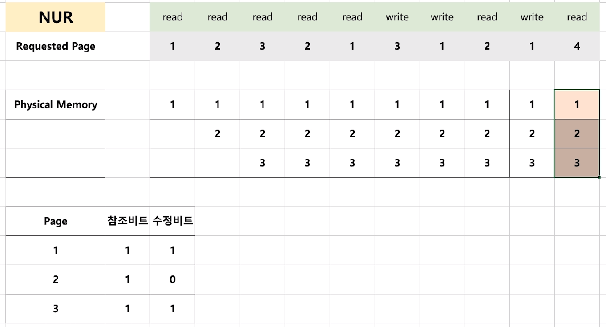
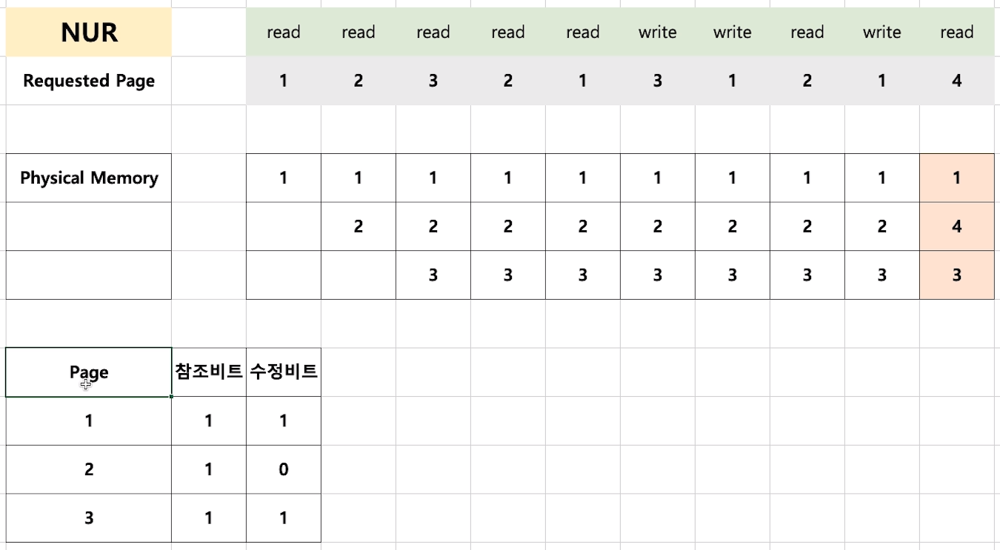
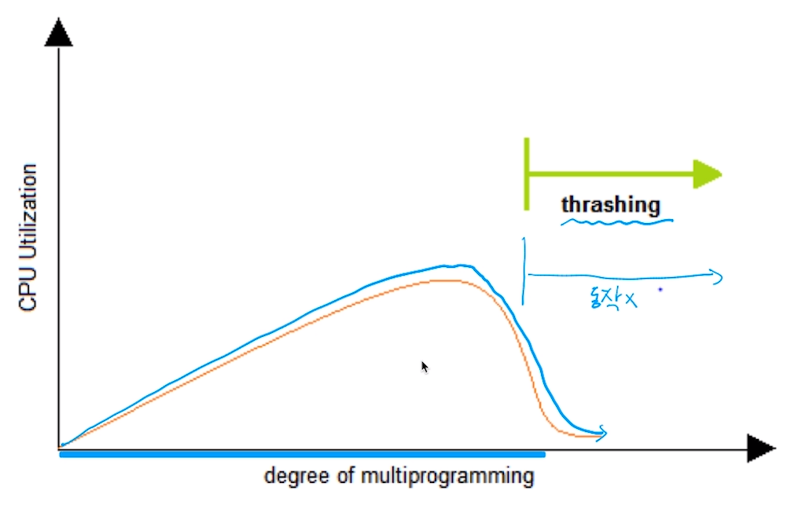

[toc]

# 페이지 교체 알고리즘

## :heavy_check_mark: 페이지 교체 알고리즘

### FIFO

- FIFO Page Replacement Algorithm
  - 가장 먼저 들어온 페이지를 내리자

 

### OPT

- 최적 페이지 교체 알고리즘 (OPTimal Replacement Alogorithm)
  - 앞으로 가장 오랫동안 사용하지 않을 페이지를 내리자
  - 일반 OS에서는 구현 불가

 

### LRU -> 가장 자주 사용

- LRU (Least Recently Used) Page Replacement Alogorithm
  - 가장 오래전에 사용된 페이지를 교체
  - OPT 교체 알고리즘이 구현이 불가이므로, 과거 기록을 기반으로 시도

 

### LFU

- LFU (Least Frequently Used) Page Replacement Alogorithm
  - 가장 적게 사용된 페이지를 내리자

 

### NUR

- NUR (Not Used Recently) Page Replacement Alogorithm
  - LRU와 마찬가지로 최근에 사용하지 않은 페이지부터 교체하는 기법
  - 각 페이지마다 참조 비트(R), 수정비트(M),을 둔다 `(R, M)`
    - (0, 0), (0, 1), (1, 0), (1, 1) 순으로 페이지 교체

## :heavy_check_mark: 스레싱 (Thrashing)

- 반복적으로 페이지 폴트가 발생해서, 과도하게 페이지 교체 작업이 일어나, 실제로는 아무일도 하지 못하는 상황

