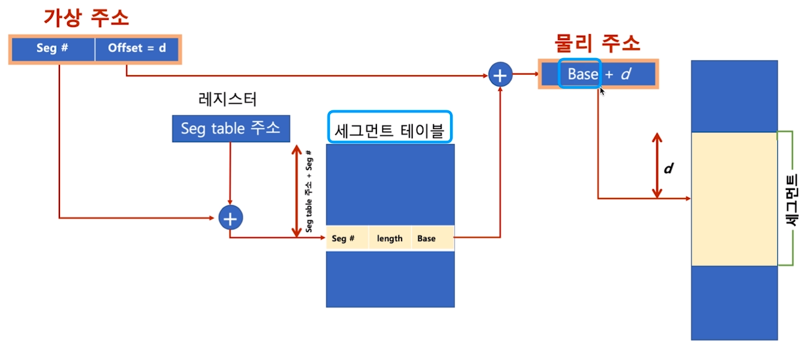
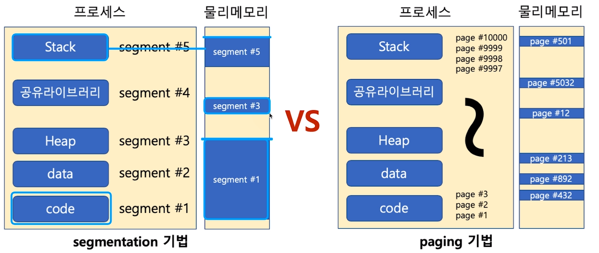

[toc]

# 세그멘테이션 (Segmentation)

## :heavy_check_mark: 세그멘테이션 기법

- 가상 메모리를 서로 크기가 다른 논리적 단위인 세그먼트(Segment)로 분할

  - 페이징 기법에서는 가상 메모리를 같은 크기의 블록으로 분할

    ex) x86 리얼 모드

    > CS (Code Segment), DS (Data Segment), SS (Stack Segment), ES (Extra Segment)로 세그먼트를 나누어, 메모리 접근

## :heavy_check_mark:  세그멘테이션 기법

- 세그먼트 가상주소

  - v = (s, d)

    - s: 세그먼트 번호
    - d: 블록 내 세그먼트의 변위

    

- 세그멘테이션은 크기가 다른 segment단위로 물리 메모리에 로딩 (페이징과 차이)

  

## :heavy_check_mark: 참고

| 페이지 기법                                                  | 세그멘테이션기법                                             |
| ------------------------------------------------------------ | ------------------------------------------------------------ |
| 내부 단편화 (페이지 블록만큼 데이터가 딱 맞게 채워져 있지 않을 때, 공간 낭비) | 외부 단편화 (물리 메모리가 원하는 연속된 크기의 메모리를 제공해주지 못하는 경우) |

> 두 기법 모두 하드웨어 지원 필요
>
> - 다양한 컴퓨터 시스템에 이식성을 중요시하는 **리눅스는 페이징 기법을 기반**으로 구현

