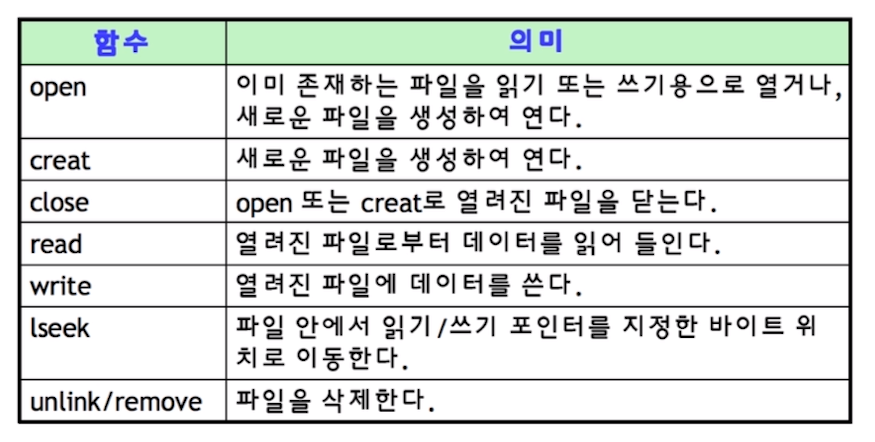

[toc]

# 파일 시스템 (File System)

- 운영체제가 저장매체에 파일을 쓰기 위한 자료구조 또는 알고리즘

## :heavy_check_mark: 파일 시스템이 만들어진 이유 (블록)

### 0과 1의 데이터를 어떻게 저장매체에 저장할까?

- 비트로 관리하기에는 오버헤드가 너무 큼
- 블록 단위로 관리하기로 함.. 보통 4KB
- 블록마다 고유 번호를 부여해서 관리

### 사용자가 각 블록 고유번호를 관리하기가 어려움

- 추상적 (논리적) 객체 필요: 파일

### 사용자는 파일 단위로 관리

- 각 파일에는 블록 단위로 관리 

## :heavy_check_mark: 저장 방법

- 저장매체에 효율적으로 파일을 저장하는 방법
  - 가능한 연속적인 공간에 파일을 저장하는 것이 좋음
  - 외부 단편화, 파일 사이즈 변경 문제로 불연속 공간에 파일 저장 기능 지원 필요
    - 블록 체인: 블록을 링크드 리스트로 연결
      - 끝에있는 블록을 찾으려면, 맨 처음 블록부터 주소를 따라가야함
    - 인덱스 블록 기법: 각 블록에 대한 위치 정보를 기록해서, 한번에 끝 블록을 찾아갈 수 있도록 함

## :heavy_check_mark: 가볍게.. 파일시스템

- Windows: FAT, FAT32, NTFS
  - 블록 위치를 FAT이라는 자료구조에 기록
- 리눅스: ext2, ext3, ext4
  - 일종의 인덱스 블록 기법인 inode 방식 사용

## :heavy_check_mark: 파일시스템과 시스템 콜

- 동일한 시스템콜을 사용해서 다양한 파일 시스템 지원 가능하도록 구현

  - read/write 시스템 콜 호출시, 각 기기 및 파일 시스템에 따라 실직적인 처리를 담당하는 함수 구현

    ex) read_spec, write_spec

  - 파일을 실제 어떻게 저장할지는 다를 수 있음

    - 리눅스의 경우 ext4외 NTFS, FAT32 파일 시스템 지원

    

