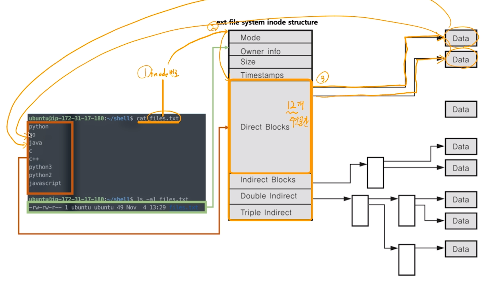

[toc]

# 파일 시스템 (File System)

## :heavy_check_mark: inode 방식 파일 시스템

- 파일 시스템 기본 구조

  - 수퍼 블록: 파일 시스템 정보

    

    

## :heavy_check_mark: 아이노드 블록: 파일 상세 정보

- 파일: inode 고유 값과 자료구조에 의해 주요 정보 관리
- '파일이름:inode' 로 파일 이름은 inode 번호와 매칭
- 파일 시스템에서는 inode를 기반으로 파일 엑세스
- inode 기반 메타 데이터 저장

## :heavy_check_mark: inode 구조

- inode 기반 메타 데이터 (파일 권한, 소유자 정보, 파일 사이즈, 생성시간 등 시간 관련 정보, 데이터 저장 위치 등..)

#### ex) `cat` 

files.txt에 맞는 inode 번호 로 블럭 접근

#### ex) `ls -al data10.txt`

## :heavy_check_mark: inode 구조와 파일 데이터

## :heavy_check_mark: 티렉토리 엔트리

- 리눅스 파일 탐색 예 `/home/ubuntu/ink.txt`
  - 각 디렉토리 엔트리(dentry)를 탐색
    - 각 엔트리는 해당 디렉토리 파일/디렉토리 정보를 가지고 있음
  - `/` dentry에서 `home`을 찾고, `home`에서 `ubuntu`를 찾고, `ubuntu`에서 `ink.txt`파일 이름에 해당하는 inode를 얻음

## :heavy_check_mark: 가상 파일 시스템 (Virtual File System)

- Network 등 다양한 기기도 동일한 파일 시스템 인터페이스를 통해 관리 가능
- ex) read/write 시스템콜 사용, 각 기기별 read_spec/write_spec 코드 구현 (운영체제 내부)

## :heavy_check_mark: 참고: 리눅스(유닉스) 운영 체제와 가상 파일 시스템

### 모든 것은 파일이라는 철학을 따름

- 모든 인터렉션은 파일을 읽고, 쓰는 것처럼 이루어져 있음
- 마우스, 키보드와 같은 모든 디바이스 관련된 기술도 파일과 같이 다루어짐
- **모든 자원에 대한 추상화 인터페이스로 파일 인터페이스 활용**

### 특수 파일 (디바이스)

- 블록 디바이스 (Block Device)
  - HDD, CD/DVD와 같이 블록 또는 섹터 등 정해진 단위로 데이터 전송
  - IO 송수신 속도가 높음 
- 캐릭터 디바이스 (Character Device)
  - 키보드 마우스 등 byte 단위 데이터 전송
  - IO 송수신 속도가 낮음
- cd / dev, cat tty