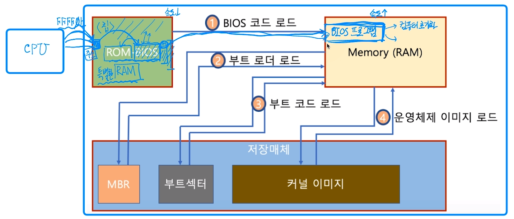
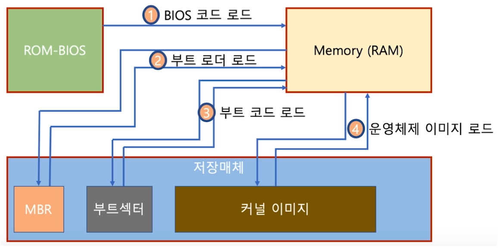

[toc]

# Boot

- 컴퓨터를 켜서 동작시키는 절차
- Boot 프로그램
  - 운영체제 커널을 storage에서 특정 주소의 물리 메모리로 복사하고 커널의 처음 실행 위치로 PC를 가져다 놓는 프로그램

## :heavy_check_mark: 부팅 과정

### 1. 컴퓨터를 키면 CPU가 BIOS가 특정 Storage를 읽어와 bootstrap loader를 메모리에 올리고 실행함

- BIOS 프로그램 - 컴퓨터 초기화, MBR (Master Boot Record)로  찾아감

  

### 2. bootstrap loader 프로그램이 있는 곳을 찾아서 실행시킴

- 파티션 Table정보가 memory에 올라감

### 3. 해당 파티션의 부트 섹터 접근

- 부트코드 로드
- 해당 파티션 안의 커널 이미지(운영체제 실행파일)로드

### 4. 커널 이미지의 첫번째로 PC를 옮겨 커널 실행

- 운영체제 이미지 로드

